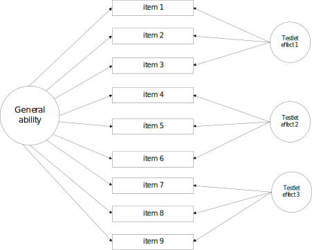
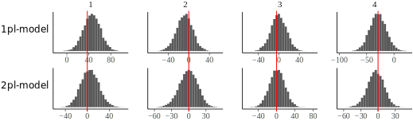
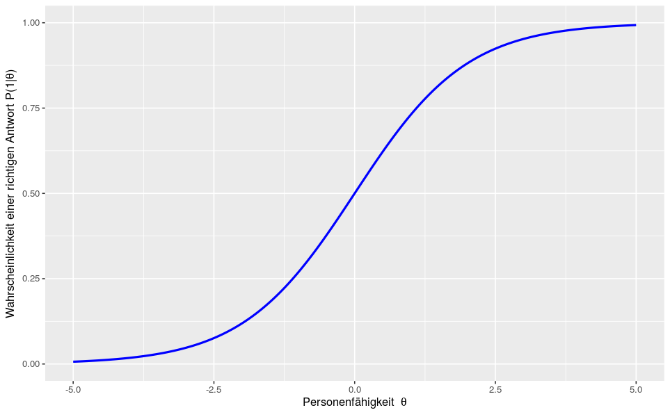
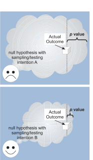
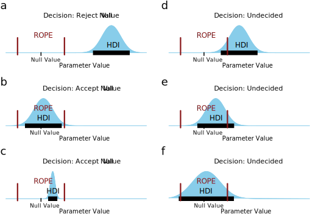
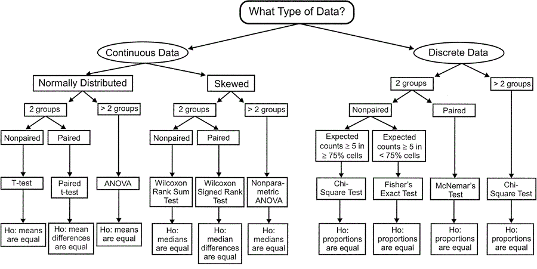

```{r setup, include=FALSE}
knitr::opts_chunk$set(echo = FALSE)
library(tidyverse)
```

<script src="https://ajax.googleapis.com/ajax/libs/jquery/1.12.2/jquery.min.js"></script>

<script>
    $(document).ready(function() {
      $('slide:not(.title-slide, .backdrop, .segue)').append('<authorname label=\"Schäfer & Tiemann\"></authorname>');
      $('slide:not(.title-slide, .backdrop, .segue)').append('<authorcompany label=\"Fachdidaktik und Lehr-/Lernforschung Chemie\"></authorcompany>');
    })
</script>

## Überblick {.build}

<div style="float: left; width: 50%;">
1. Motivation
1. Item Response Theorie
1. IRT-Modelle in R

1. Inferenzstatistik
1. Satz von Bayes
1. Bayes'sche Statistik-Pakete in R
1. IRT und GLM
1. Bayes'sche IRT in R
</div>

<div style="float: right; width: 50%;">
<div class="lessspace">**Was ich voraussetze:**</div>
- R & RStudio
- Pipeoperator `%>%`
- Item Response Theorie
</div>

<div class="notes">
**Was**
- Methodik: Bayes'sche IRT-Modellierung
- R-Package-Premiere: birtms

**Was nich**
- Funktionsweise unterschiedlicher MCMC-Algorithmen
- Vielfalt verfügbarer Prior
- fachdidaktische Erkenntnisse
</div>

## Motivation

<div>
- Professionswissens von Chemie-Studierenden mit Lehramtsoption
- deklarativ-fachdidaktischer Wissenstest
</div>

<div>
  <figure>
  
  <figcaption style="font-size: small; text-align: center; margin-top: 5px">Itemstamm 059MC</figcaption>
  </figure>
</div>

<div class="notes">
- Ursprünglich: Intervention im Bereich Lernvideos
- ergänzend zum prozedural-konditionalen Test aus dem ProwiN-Projekt
- Interesse, Motivation, Persönlichkeit, $\dots$
</div>

## Motivation

<div>
- Professionswissens von Chemie-Studierenden mit Lehramtsoption
- deklarativ-fachdidaktischer Wissenstest
</div>

<div style="bottom: 60px; left: 90px; position: absolute; width=500px">
  <figure>
  
  <figcaption style="font-size: small; text-align: center; margin-top: 3px">Antwortoptionen 059MC</figcaption>
  </figure>
</div>

<div style="bottom: 60px; left: 550px; position: absolute">
  <figure>
  
  <figcaption style="font-size: small; text-align: center; margin-top: 10px">Grafik aus @Zhang.2011</figcaption>
  </figure>
</div>

<div class="notes">
- real Multiple-Choice- und Sortier-Aufgaben<br>einzeln auswerten
- Auswertungsmethoden:
  - Alles-oder-nichts
  - Partial-Credit / Ordinal
  - jede Antwortoption / jeden Paarvergleich einzeln
- Bifaktor-Struktur / Testlet-Modell
</div>

## Motivation

<div>
- Professionswissens von Chemie-Studierenden mit Lehramtsoption
- deklarativ-fachdidaktischer Wissenstest
- Bayes'sches MIRT-Modell ab 100 Personen <small>[@Fujimoto.2020]</small>
</div>

<div style="position: absolute; bottom: 60px; width: 1000px">
  <figure>
  
  <figcaption style="font-size: small; text-align: center; margin-top: 10px">Biasreduzierender Effekt informativer Priors; Grafik aus @Fujimoto.2020</figcaption>
  </figure>
</div>

<div class="notes">
- Prior-Einfluss verschwindet ab 500 Beobachtungen
</div>

## Motivation

<div>
- Professionswissens von Chemie-Studierenden mit Lehramtsoption
- deklarativ-fachdidaktischer Wissenstest
- Bayes'sches MIRT-Modell ab 100 Personen <small>[@Fujimoto.2020]</small>
- Bayes'sche IRT Modellierung mit brms <small>[@Burkner.23.05.2019]</small>
</div>

<div style="position: absolute; bottom: 60px; width: 1000px">
  <figure class="txtover">
  
  <figcaption style="font-size: small; text-align: center; margin-top: 5px">Posterior Predictive Model Check (**PPMC**); Grafik aus @Burkner.2020</figcaption>
  </figure>
</div>

<div class="notes">
- deutlich: loglik-Kriterium für Item 1 und 4 (5, 6, 9, 10, 12) nicht reproduziert durch geschätzte Schwierigkeit allein
</div>

## Motivation

  <figure>
  
  <figcaption style="font-size: small; text-align: center; margin-top: 5px">Shiny-App für den direkten Modellvergleich</figcaption>
  </figure>


<div class="notes">
- 1pl bis 3pl
- mit und ohne Testlets
- nur für die eigenen Modelle
- Shiny-App für allgemeine Modelle mit **birtms** das Ziel
</div>

## Motivation

<div>
- Professionswissens von Chemie-Studierenden mit Lehramtsoption
- deklarativ-fachdidaktischer Wissenstest
- Bayes'sches MIRT-Modell ab 100 Personen <small>[@Fujimoto.2020]</small>
- Bayes'sche IRT Modellierung mit brms <small>[@Burkner.23.05.2019]</small>
- Marginal Likelihood für Modellvergleiche <small>[@Merkle.2019]</small>
</div>

<div style="position: absolute; bottom: 60px; width: 1000px">
  <figure>
  
  <figcaption style="font-size: small; text-align: center; margin-top: 5px">Informationskriterien unter Nutzung der conditional und marginal likelihood; Grafik aus @Merkle.2019</figcaption>
  </figure>
</div>

<div class="notes">
- Vergleich von 5 Modellen mit unterschiedlich vielen Freiheitsgraden
- conditional loglik
  - Schätzfehler größer
  - IC Wert generell geringer (gaukelt guten fit vor)
  - komplexere Modelle passen tendenziell besser
- marginal loglik: Entscheidung für Model 2
</div>

## Item Response Theorie {.build}

<div style="width: 50%; float: left">
- latente Variablen
  - Personenfähigkeiten $\theta_k$
  - Itemparameter $\beta_i, \alpha_i, \dots$
- logistisches Modell (GLM)
- lokale Unabhängigkeit
</div>

<div style="width: 50%; float: right">
<div class="nospace">**Raschmodell:**</div>
$$P\left(1|\theta_k, \beta_i\right)=\frac{\exp\left(\theta_k + \beta_i\right)}{1+\exp\left(\theta_k + \beta_i\right)}$$
</div>

<div style="width: 50%; float: right; margin-top: 10px">
  <figure>
    
    <figcaption style="font-size: small; text-align: center;">Grafik aus @Grottke.2021</figcaption>
  </figure>
</div>

<div style="width: 50%; float: left; padding-top: 20px">
<div class="lessspace">*Ausnahmen:*</div>
- latente Regression
- Testlets
</div>

## IRT-Modelle in R

[Packeges](https://cran.r-project.org/web/views/Psychometrics.html)
- **TAM**, **mirt**
- eRm, lme4
- *flirt* <small>[@Jeon.2016]</small>

```{r echo=FALSE}
# data_spm <- rio::import("../data/data_spm.rda")
```

```{r eval=TRUE, include=FALSE}
# mod1PL <- TAM::tam.mml(resp=data_spm)
```

## Inferenzstatistik

```{r, echo=FALSE, include=FALSE}
x <- c(F, rep(T, 8))
p <- round(sum(x)/length(x), 2)
se <- sqrt(p*(1-p)/length(x))
p_lci <- max(0, p-1.96*se) %>% round(2)
p_uci <- min(1, p+1.96*se) %>% round(2)
p_val <- (pbinom(1, 9, .5)+1-pbinom(8, 9, .5)) %>% round(3)
```

<div>
<div style="float: left; width: 50%;">
Münzwurf: `r as.numeric(x)`
</div>

<div style="float: right; width: 50%;">
$X \sim binom(n, p)$
</div>
</div>

```{r}
data <- tibble::tribble(
  ~"Aspekt", ~"Klassisch / Frequentistisch", ~"Bayes'sch / Bayesianisch",
  "Wahrscheinlichkeit", "relative Häufigkeit", "Grad persönlicher Überzeugung",
  "Vorannahme", "Münze fair", "Münze fair (SD = .10)",
)

knitr::kable(data)
```

<div class="notes">
Neben der gemeinsamen Datenbasis haben wir uns für ein gemeinsames Modell entschieden. Wir glauben, die Daten basieren auf einem Prozess, der mit der Binomialverteilung modelliert werden kann.
</div>

## Inferenzstatistik

<div>
<div style="float: left; width: 50%;">
Münzwurf: `r as.numeric(x)`
</div>

<div style="float: right; width: 50%;">
$X \sim binom(n, p)$
</div>
</div>

```{r}
data <- tibble::tribble(
  ~"Aspekt", ~"Klassisch / Frequentistisch", ~"Bayes'sch / Bayesianisch",
  "Wahrscheinlichkeit", "relative Häufigkeit", "Grad persönlicher Überzeugung",
  "Vorannahme", "Münze fair", "Münze fair (SD = .10)",
  "P(X=1) =", paste0(p, " [", p_lci, ", ", p_uci, "]"), "",
  "Hypothesentest", as.character(p_val), "",
  "Entscheidung", "nicht fair", ""
)

knitr::kable(data)
```

## Inferenzstatistik

<div>
<div style="float: left; width: 50%;">
Münzwurf: `r as.numeric(x)`
</div>

<div style="float: right; width: 50%;">
$X \sim binom(n, p)$
</div>
</div>

```{r}
data <- tibble::tribble(
  ~"Aspekt", ~"Klassisch / Frequentistisch", ~"Bayes'sch / Bayesianisch",
  "Wahrscheinlichkeit", "relative Häufigkeit", "Grad persönlicher Überzeugung",
  "Vorannahme", "Münze fair", "Münze fair (SD = .10)",
  "P(X=1) =", paste0(p, " [", p_lci, ", ", p_uci, "]"), "",
  "Hypothesentest", as.character(p_val), "",
  "Entscheidung", "nicht fair", ""
)

knitr::kable(data)
```

<div style="margin-top: -184px; left: 650px; position: absolute">
  <figure>
  
  <figcaption style="font-size: small; text-align: center; margin-left: 270px; margin-top: -150px; transform: rotate(-90deg); width: 250px">Grafik erstellt mit @JASP2020</figcaption>
  </figure>
  </div>


## Inferenzstatistik

<div>
<div style="float: left; width: 50%;">
Münzwurf: `r as.numeric(x)`
</div>

<div style="float: right; width: 50%;">
$X \sim binom(n, p)$
</div>
</div>

```{r}
data <- tibble::tribble(
  ~"Aspekt", ~"Klassisch / Frequentistisch", ~"Bayes'sch / Bayesianisch",
  "Wahrscheinlichkeit", "relative Häufigkeit", "Grad persönlicher Überzeugung",
  "Vorannahme", "Münze fair", "Münze fair (SD = .29)",
  "P(X=1) =", paste0(p, " [", p_lci, ", ", p_uci, "]"), "",
  "Hypothesentest", as.character(p_val), "",
  "Entscheidung", "nicht fair", ""
)

knitr::kable(data)
```

<div style="margin-top: -184px; left: 650px; position: absolute">
  <figure>
  
  <figcaption style="font-size: small; text-align: center; margin-left: 270px; margin-top: -150px; transform: rotate(-90deg); width: 250px">Grafik erstellt mit @JASP2020</figcaption>
  </figure>
  </div>

<div class="notes">
- Gefühle in der Wissenschaft?
- Subjektivität = Willkür?
- Wald-CI geschätzt (und nach oben beschnitten) vs. simulierte CIs
</div>

## Inferenzstatistik

<div style="float: left; width: 70%">
Modell: $X \sim binom(n, p)$

Beendigung der Datenerhebung nach:

1. 9 Würfen
1. *8 mal Kopf*
1. 1 Minute

**p-value**:
<cite>Die Wahrscheinlichkeit in einer Stichprobe der hypothetischen Population ein Ergebnis zu erhalten, dass mindestens so extrem wie das vorliegende Ergebnis ist, *wobei die beabsichtigten Erhebungs- und Auswertungsmethoden berücksichtigt werden müssen*.</cite>
</div>

<div style="float: right; width: 30%; margin-top: -50px">
  <figure>
  
  <figcaption style="font-size: small; text-align: center; margin-top: 5px;">Grafik aus @Kruschke.2015</figcaption>
  </figure>
</div>

<div class="notes">
- Intuitive Interpretation: nur in p % der Fälle kommt dieses Ergebnis zu stande
- Uneindeutigkeit im frequentistischen oft unberücksichtigt
- unterschiedliche p-values für einen Datensatz
- Datenerhebung:
  - Einzelperson: Power- oder Speedtest?
    - Beantwortet Frage mit bestimmter Wahrscheinlichkeit
    - Summenscore als Binomialverteilung (konstante Schwierigkeiten) oder Summe von Bernoulli-Versuchen (verallg. Binomialverteilt)
    - Wie viele Fragen bearbeitet er?
  - Was das Kriterium für die Stichprobe
- Anzahl und Art zusätzlicher Tests verändert Imagionary Sample Space weiter
- 8 mal Kopf erzeugt Bias
  - Adaptives Testen: will keine neuen Daten erzeugen, sondern bewerten
</div>

## Inferenzstatistik {.smaller}
<div>
  <figure>
  
  <figcaption style="font-size: small; text-align: center; margin-top: 5px;">Grafik nach @Kruschke.2015</figcaption>
  </figure>
</div>

<div>
<br>
zweite Münze 24 mal werfen: $p\left(\frac{z_1}{N_1}\right) = 0.063$
<br>
zweite Münze 12 mal werfen: $p\left(\frac{z_1}{N_1}\right) = 0.103$
</div>

<div class="notes">
- Zweite Münze muss nicht mal geworfen werden!
</div>

## Inferenzstatistik {.build}

<div style="float: left; width: 65%; margin-top: 0px">
- sind Nägel fair?
- 7 von 24 stehen
- verwerfen die Hypothese nicht!
  
</div>

<div style="float: left; width: 65%; margin-top: 0px">

- Vorwissen berücksichtigen
  - Berücksichtigung seltener Ereignisse
  - bedeutsame Parametervergleiche
  - Datensätze erweitern
- Einfluss des Priors nimmt mit Datenmenge ab
  
</div>

<div style="float: right; width: 35%; margin-top: -200px">
  <figure>
  
  <figcaption style="font-size: small; text-align: center; margin-top: 5px;"><https://xkcd.com/1132/></figcaption>
  </figure>
</div>

<div class="notes">
- schwache Prior führen quasi zu frequentistischen Ergebnissen
- Einfluss des Priors kann überprüft werden
</div>

## Inferenzstatistik

<div style="float: left; width: 60%; margin-top: 0px">
- Ablehnen der Nullhypothese spricht nicht für Alternativhypothese
- Bayes-Faktor: pro H0, ungewiss, pro H1
- Informationsverlust
  - behindert Metaaanalysen
- Parameterwerte und CIs statt NHST?
  - Effektstärke
  - CI enthält Werte, die von NHST nicht abgelehnt würden
  - frequentistische CIs auch vom Sample Space abhängig

  <figure>
  
  <figcaption style="font-size: small; text-align: center; margin-top: 5px;">Grafik aus @Kruschke.2018</figcaption>
  </figure> 
</div>

<div style="float: right; width: 35%; margin-top: 0px">
  <figure>
  
  <figcaption style="font-size: small; text-align: center; margin-top: 5px;">Grafik aus @Kruschke.2018</figcaption>
  </figure>
</div>

<div class="notes">
- NHST verkürzt unsere Informationen auf Ja/Nein
- CI: Konfidenzintervall basiert auf Vorannahmen und Schätzungen
  - Interpretation: bei vielen Wiederholungen wird der wahre Parameter in 95 % der Fälle im CI liegen
  - keine Informationen über Parameterverteilung
    - Unimodalität
    - Schiefe
</div>

## Inferenzstatistik


<div style="float: left; width: 50%;">
### Mehls Paradox ROPE
</div>

<div style="float: right; width: 50%;">
  <figure>
  
  <figcaption style="font-size: small; text-align: center; margin-top: 5px;">Grafik aus @Waning.2001</figcaption>
  </figure>
</div>

## Inferenzstatistik

  <figure>
  
  <figcaption style="font-size: small; text-align: center; margin-top: 5px;">Grafik aus @Waning.2001</figcaption>
  </figure>
  
<div class="notes">
<div style="float: left; width: 50%;">
### Frequentistisch
- Problematisch für kleine Stichproben
  - brauchen unterschiedliche Tests für unterschiedliche Szenarien

</div>

<div style="float: right; width: 50%;">
### Bayes'sch
- Prior können normal Gestalthaben, aber auch non-normale Daten fitten

</div>
</div>


## Inferenzstatistik Backlog

<div style="float: left; width: 40%;">
### Klassisch
- Parameter haben einen festen Wert, den wir schätzen wollen
  - ein CI sagt nicht, dass der Wert einer Verteilung unterliegt, sondern nur, in welchem Beeich der wahre Wert liegen sollte
- $\alpha$-Fehler Korrektur
  - in höchstens $\alpha \, %$ der Wiederholungen ist überhaupt ein Parameter außerhalb der CI

</div>

<div style="float: right; width: 60%;">
### Bayes'sch
- CI: Kredibilitätsintervall Ergebnis von Simulation
  - Parameterverteilung zeigt, die wahrscheinlichten Werte an
  - Breite $\sim$ Unsicherheit
  - HDI statt equallt tailed CI
  - Median oder Modalwert statt Mittelwert
  - Passendes zentrales Maß anhand der Parameterverteilung wählbar
  - Bimodale und schiefe Verteilungen identifizierbar
- Hardware
  - braucht mehr Rechenzyklen
  - braucht mehr Arbeitsspeicher (oder noch mehr Zeit)
  - braucht mehr Festplattenspeicher
- können Unsicherheit in Folgeanalysen mitberücksichtigen
- prädiktive Modelle
- Messunsicherheit berücksichtigen
- fehlende Werte imputieren
- nutzen wir die Möglichkeit der Priors in den IRT-Modellen schon?
- likelihood / Posterior unabhängig von Testanzahl
- poweranalysis by simulation
- PPMC mit oder ohne p-value?
</div>

## Satz von Bayes {.build}

<div>
$$ P(A|B) = \frac{P(B|A) \cdot P(A)}{P(B)}$$
</div>

<div>
Angewendet auf Modelle:
$$ P(Parameter|Daten) = \frac{P(Daten|Parameter) \cdot P(Parameter)}{P(Daten)}$$
</div>

<div>
Gesprochen:
$$ \mathbf{Posterior\:Wahrs.} = \frac{\mathbf{Modellfunktion} \cdot \mathbf{Prior\:Wahrs.}}{\mathbf{Normierungsfaktor}}$$
</div>

<div class="notes">
- Statt Parametern kann man auch von Hypothesen sprechen: ist $\beta_i = 0$?
- Modellfunktion = Likelihood
- Normierungsfaktor: marginale Wahrscheinlichkeit
</div>

## Bayes'sche Statistik-Pakete in R

<div style="float: left; width: 50%;">
### Modelle fitten

- Stan:
  - *rstan*
  - *rstanarm*
  - **brms**
- JAGS: *rjags*
- *rethinking*
- *BayesFactor*
- *blavaan*

</div>

<div style="float: right; width: 50%;">
### Modelle auswerten

- *tidybayes*
- *loo*
- *bayestestR*
- *coda*, *plotMCMC*
- *bridgesampling*

</div>


<div class="notes">
<div style="float: left; width: 50%;">

- Stan oder JAGS brauchen compiler-Zeit
- kleine Modelle besser direkt simulieren

- Stan: Hameltonian Monte Carlo sampling 
  - *rstan*: Stan syntax
  - *rstanarm*: Gelman et al. (früher *arm* genutzt)
  - **brms**: bayesian GLMs
- JAGS: *rjags*: Gibbs sampling; JAGS/WinBUGS syntax
- *rethinking*: McElreath
- *BayesFactor*: Hypothesis checking
- *blavaan*: SEMs in Stan (neu) oder JAGS

</div>

<div style="float: right; width: 50%;">

- *tidybayes*: plots and long data extraction
- *loo*: Modellvergleiche mit leave-one-out CV
- *bayestestR*: model checking and evaluation
- *coda*, *plotMCMC*: MCMC-chain plots
- *bridgesampling*: Bayes factor for whole models

</div>
</div>

## IRT und GLM


## Hypothesentests und Modellvergleiche

<div style="float: left; width: 50%;">
- Hypothesen-Modell-Beziehung N:M
- Modell verwerfen $\nLeftrightarrow$ Hypothese verwerfen

$$\begin{align}
y &\sim item + person + fw \\
y &\sim item + person + fw^2 \\
y &\sim item + person + fw*rpk
\end{align}$$

$fw$: Fachwissen<br>$rpk$: Repräsentationskenntnis
</div>

<div style="float: right; width: 50%;">

<figure>
  
  <figcaption style="font-size: small; text-align: center; margin-top: 5px">Grafik aus @McElreath.2020</figcaption>
</figure>

</div>

<div class="notes">
- Fachwissenseinfluss kann vielei Gestalt haben
- Moderationsbeziehung mathematisch uneindeutig
- Parameterbetrachtung selbst in suboptimalen Modellen
</div>

## Modellvergleiche

- Kruschke schlägt vor, mehrere Modell in einem Obermodell zusammenzufassen
  - in Stan schwerlich möglich, da keine diskreten Variablen gezogen werden
- BayesFaktor via BridgeSampling braucht viele Posterior Samples
  - Bayes-Faktor prior-sensibel
- Bürkner favorisiert PSIS LOO-CV
  - conditional LOO bevorzugt komplexere Modelle
  - marginal LOO weist auf Probleme mit PSIS hin
  - LOO oder k-fold können bei komplexeren Modellen sehr lange dauern

<<div class="notes">
- Bridge Sampling: 110000 statt 2000
</div>

## Bayes'sche IRT

1. Daten vorbereiten
1. Modell formulieren
1. Konvergenz der MCMC-Chains prüfen ($\hat{r}$, plots)
1. Posterior Predictive Model Checking

<div style="float: left; width: 50%;">
### Modellvergleiche
- Dimensionalitätsanalysen
- Prädiktorenwahl
- Wirkungsmodelle prüfen (DAGs)

</div>

<div style="float: right; width: 50%;">
### Parameterinspektion
- Itemselektion
- DIF
- Effektstärken
- $\dots$
</div>

## Bayes'sche IRT in R

<div style="float: left; width: 50%;">
### EM Algorithmus

- bis zur Konvergenz:
  - Wähle SD der random effect Verteilung
  - Wähle random effect Werte
  - maximiere die Likelihood
    <br>(analytisch oder per Newton-Verfahren)
- Präsentiere beste Punktschätzer
- Präsentiere Schätze CI

</div>

<div style="float: right; width: 50%;">
### MCMC Algorithmus

- Burn-in / warmup-Pahse
- Sampling-Phase
- Präsentiere Postsamples
- Deskriptive Statistik der Postsamples

Schritte:
- Wähle Parameter in der Imgebung
- berechne Likelihood
  - besser: akzeptiere Werte
  - schlechter: werfe biased Münze
    - Kopf: akzeptiere Werte
    - Zahl: verwerfe Werte, wähle neue
</div>

<div class="notes">
- MCMC Sampling: <https://elevanth.org/blog/2017/11/28/build-a-better-markov-chain/>
</div>

## Bayes'sche IRT in R

<div style="float: left; width: 35%;">
### Modelle spezifizieren

- Stan syntax:
  - *rstan*
  - *edstan*
- GLM syntax:
  - *brms*
- Keyword based
  - **birtms**

</div>

<div style="float: right; width: 65%;">
### Modelle auswerten mit birtms

- marginal loglikelihood Modellvergleiche
- bayes'sche Variante des $R^2$-Bestimmtheitsmaß
- Item Characteristic Curves
- Odds Ratio Heatmaps
- Itemparameterverteilungen darstellen
- Posterior Predictive Model Checks
- Persone Response Functions
- Wrightmap

</div>

## birtms


## Ausblick {.smaller}

<div style="float: left; width: 50%;">
### Funktionalitäten
- **testlets**
- **Shiny-App**
- *3pl*
- Itemkriterien <smaller>[vgl. @Scharl.2019]</smaller>
- hierarchic
- ordinal
- multidim
- multivariate
- 4pl
- noncompensatory
</div>

<div style="float: right; width: 50%;">
### Paket
- Dokumentation
- Vignetten
- Videotutorials
- Performance
- Vereinheitlichung
- Abhängigkeiten reduzieren
- Mehrsprachigkeit
</div>

<div class="notes">
- Dokumentation:
  - Kapitel im GDCP-Psychometriebuch
- multivariat:
  - SEM / latente Variablen
  - Hoffnung: brms 3 Funktionalitäten
</div>

## Zusammenfassung
- Aufruf
  - zur Zusammenarbeit
  - zur kritischen Prüfung

## Slide with R Output

```{r cars, echo = TRUE}
summary(cars)
```

## Slide with Plot

```{r pressure}
plot(pressure)
```

