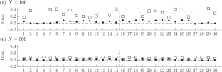
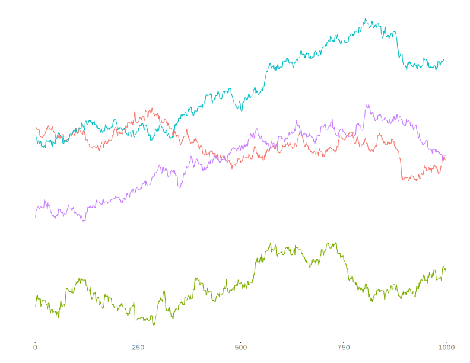
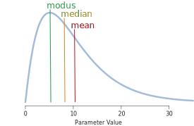
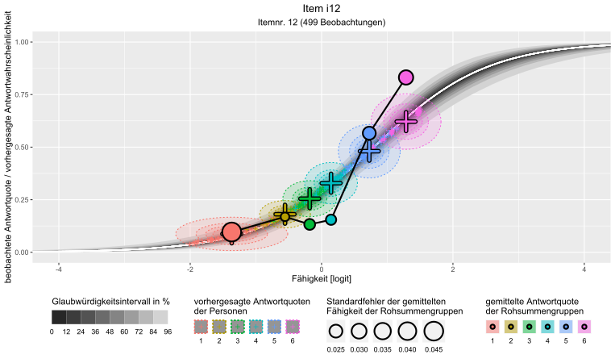
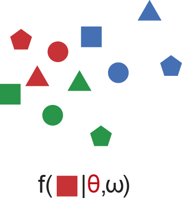
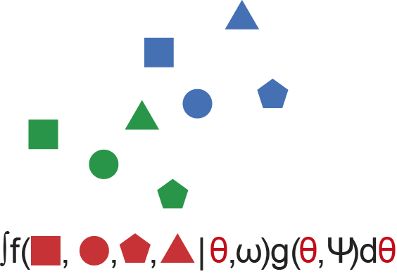
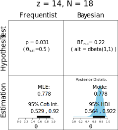

```{r setup, include=FALSE}
knitr::opts_chunk$set(echo = FALSE)
library(tidyverse)
```

<script src="https://ajax.googleapis.com/ajax/libs/jquery/1.12.2/jquery.min.js"></script>

<script>
    $(document).ready(function() {
      $('slide:not(.title-slide, .backdrop, .segue)').append('<authorname label=\"Schäfer & Tiemann\"></authorname>');
      $('slide:not(.title-slide, .backdrop, .segue)').append('<authorcompany label=\"Fachdidaktik und Lehr-/Lernforschung Chemie\"></authorcompany>');
    })
</script>

## Überblick {.build}

<div style="float: left; width: 50%;">
1. Motivation
1. Item Response Theorie
1. IRT-Modelle in R

1. Inferenzstatistik
1. Satz von Bayes
1. Bayes'sche Statistik-Pakete in R
1. IRT und GLM
1. Bayes'sche IRT in R
</div>

<div style="float: right; width: 50%;">
<div class="lessspace">**Was ich voraussetze:**</div>
- R & RStudio
- Pipeoperator `%>%`
- Item Response Theorie
- Differenzierung zw. frequentistischer und Bayesianischer Inferenzstatistik
</div>

<div class="notes">
**Was**
- Methodik: Bayes'sche IRT-Modellierung
- R-Package-Premiere: birtms

**Was nich**
- fachdidaktische Erkenntnisse
</div>

## Motivation

<div>
- Professionswissens von Chemie-Studierenden mit Lehramtsoption
- deklarativ-fachdidaktischer Wissenstest
</div>

<div>
  <figure>
  
  <figcaption style="font-size: small; text-align: center; margin-top: 5px">Itemstamm 059MC</figcaption>
  </figure>
</div>

<div class="notes">
- Ursprünglich: Intervention im Bereich Lernvideos
- ergänzend zum prozedural-konditionalen Test aus dem ProwiN-Projekt
- Interesse, Motivation, Persönlichkeit, $\dots$
</div>

## Motivation {.build}

<div>
- Professionswissens von Chemie-Studierenden mit Lehramtsoption
- deklarativ-fachdidaktischer Wissenstest
</div>

<div style="bottom: 60px; left: 90px; position: absolute; width=500px">
  <figure>
  
  <figcaption style="font-size: small; text-align: center; margin-top: 3px">Antwortoptionen 059MC</figcaption>
  </figure>
</div>

<div style="bottom: 60px; left: 550px; position: absolute">
  <figure>
  
  <figcaption style="font-size: small; text-align: center; margin-top: 10px">Grafik aus @Zhang.2011</figcaption>
  </figure>
</div>

<div class="notes">
- real Multiple-Choice- und Sortier-Aufgaben<br>einzeln auswerten
- Auswertungsmethoden:
  - Alles-oder-nichts
  - Partial-Credit / Ordinal
  - jede Antwortoption / jeden Paarvergleich einzeln
- Bifaktor-Struktur / Testlet-Modell
</div>

## Motivation

<div>
- Professionswissens von Chemie-Studierenden mit Lehramtsoption
- deklarativ-fachdidaktischer Wissenstest
- Bayes'sches MIRT-Modell ab 100 Personen <small>[@Fujimoto.2020]</small>
</div>

<div style="position: absolute; bottom: 60px; width: 1000px">
  <figure>
  
  <figcaption style="font-size: small; text-align: center; margin-top: 10px">Biasreduzierender Effekt informativer Priors; Grafik aus @Fujimoto.2020</figcaption>
  </figure>
</div>

<div class="notes">
- Prior-Einfluss verschwindet ab 500 Beobachtungen
</div>

## Motivation

<div>
- Professionswissens von Chemie-Studierenden mit Lehramtsoption
- deklarativ-fachdidaktischer Wissenstest
- Bayes'sches MIRT-Modell ab 100 Personen <small>[@Fujimoto.2020]</small>
- Bayes'sche IRT Modellierung mit brms <small>[@Burkner.23.05.2019]</small>
</div>

<div style="position: absolute; bottom: 60px; width: 1000px">
  <figure class="txtover">
  
  <figcaption style="font-size: small; text-align: center; margin-top: 5px">Posterior Predictive Model Check (**PPMC**); Grafik aus @Burkner.2020</figcaption>
  </figure>
</div>

<div class="notes">
- deutlich: loglik-Kriterium für Item 1 und 4 (5, 6, 9, 10, 12) nicht reproduziert durch geschätzte Schwierigkeit allein
</div>

## Motivation

  <figure>
  
  <figcaption style="font-size: small; text-align: center; margin-top: 5px">Shiny-App für den direkten Modellvergleich</figcaption>
  </figure>


<div class="notes">
- 1pl bis 3pl
- mit und ohne Testlets
- nur für die eigenen Modelle
- Shiny-App für allgemeine Modelle mit **birtms** das Ziel
</div>

## Motivation

<div>
- Professionswissens von Chemie-Studierenden mit Lehramtsoption
- deklarativ-fachdidaktischer Wissenstest
- Bayes'sches MIRT-Modell ab 100 Personen <small>[@Fujimoto.2020]</small>
- Bayes'sche IRT Modellierung mit brms <small>[@Burkner.23.05.2019]</small>
- Marginal Likelihood für Modellvergleiche <small>[@Merkle.2019]</small>
</div>

<div style="position: absolute; bottom: 60px; width: 1000px">
  <figure>
  
  <figcaption style="font-size: small; text-align: center; margin-top: 5px">Informationskriterien unter Nutzung der conditional und marginal likelihood; Grafik aus @Merkle.2019</figcaption>
  </figure>
</div>

<div class="notes">
- Vergleich von 5 Modellen mit unterschiedlich vielen Freiheitsgraden
- conditional loglik
  - Schätzfehler größer
  - IC Wert generell geringer (gaukelt guten fit vor)
  - komplexere Modelle passen tendenziell besser
- marginal loglik: Entscheidung für Model 2
</div>

## Item Response Theorie {.build}

<div style="width: 50%; float: left">
- latente Variablen
  - Personenfähigkeiten $\theta_k$
  - Itemparameter $\beta_i, \alpha_i, \dots$
- logistisches Modell (GLM)
- lokale Unabhängigkeit
</div>

<div style="width: 50%; float: right">
<div class="nospace">**Raschmodell:**</div>
$$P\left(1|\theta_k, \beta_i\right)=\frac{\exp\left(\theta_k + \beta_i\right)}{1+\exp\left(\theta_k + \beta_i\right)}$$
</div>

<div style="width: 50%; float: right; margin-top: 10px">
  <figure>
    
    <figcaption style="font-size: small; text-align: center;">Grafik aus @Grottke.2021</figcaption>
  </figure>
</div>

<div style="width: 50%; float: left; padding-top: 20px">
<div class="lessspace">*Ausnahmen:*</div>
- latente Regression
- Testlets
</div>

## Item Response Theorie {.build}

<div style="width: 50%; float: left">
<div class="lessspace">**Vorgehensweise:**</div>
1. **Forschungsfragen aufstellen**
1. Erhebung planen
1. *Testinstrument entwickeln*
1. Daten vorbereiten
</div>

<diV style="width: 100%; bottom: 50px; position: absolute;">
```{r echo=FALSE}
data_spm <- rio::import("../../data/data_spm.rda")
head(data_spm)
```
</div>

<div style="width: 50%; float: right; margin-top: -70px">
  <figure>
  
  <figcaption style="font-size: small; text-align: center; margin-top: 5px;">Einfaches Item aus Ravens SPM;<br>Grafik aus @Schoevers.2020</figcaption>
  </figure>
</div>

<div class="notes">
- @Burkner.2020
- Ravens Standard Progressive Matrices
- 12 komplexesten Items
- daten im wide format
</div>

## Item Response Theorie {.build}

<div style="width: 50%; float: left">
<div class="lessspace">**Vorgehensweise:**</div>
1. **Forschungsfragen aufstellen**
1. Erhebung planen
1. *Testinstrument entwickeln*
1. Daten vorbereiten
1. Modell formulieren
1. <big>Modell fitten</big>
</div>

<div style="width: 50%; float: right">
<div class="lessspace">[R Packages](https://cran.r-project.org/web/views/Psychometrics.html)</div>
- **TAM**, **mirt**
- eRm, lme4
- *flirt* <small>[@Jeon.2016]</small>
</div>

<div class="notes">
- Entscheidung für Raschmodell
- Kurzer Blick auf TAM
</div>

## IRT-Modelle mit TAM

<div style="float: left; width: 50%;">
```{r eval=FALSE, echo=TRUE}
mod1PL <- TAM::tam.mml(resp=data_spm[-1])
```
</div>

```{r eval=TRUE, include=FALSE}
mod1PL <- TAM::tam.mml(resp=data_spm[-1])
```

<div style="float: right; width: 50%;">
```{r eval=TRUE}
mod1PL
```
</div>

## IRT-Modelle mit TAM

<div style="float: left; width: 50%;">
```{r eval=FALSE, echo=TRUE}
mod1PL <- TAM::tam.mml(resp=data_spm[-1])

head(mod1PL$item)
```
</div>

<div style="float: right; width: 50%;">
```{r eval=TRUE}
head(mod1PL$item_irt)
```
</div>

<div class="notes">
**Achtung:** birtms gibt bei default Itemleichtigkeiten aus!
</div>

## Item Response Theorie

<div style="width: 50%; float: left">
<div class="lessspace">**Vorgehensweise:**</div>
1. **Forschungsfragen aufstellen**
1. Erhebung planen
1. *Testinstrument entwickeln*
1. Daten vorbereiten
1. Modell formulieren
1. Modell fitten
1. <big>Modellpassung prüfen</big>
</div>

<div style="width: 50%; float: right;">
1. Konvergenz
2. Reliabilität
</div>

<div style="width: 50%; float: right;">
```{r echo=TRUE}
mod1PL$EAP.rel
```
</div>

<div class="notes">

</div>

## Item Response Theorie

<div style="width: 50%; float: left">
<div class="lessspace">**Vorgehensweise:**</div>
1. **Forschungsfragen aufstellen**
1. Erhebung planen
1. *Testinstrument entwickeln*
1. Daten vorbereiten
1. Modell formulieren
1. Modell fitten
1. Modellpassung prüfen
1. <big>Itemselektion</big>

```{r eval=FALSE, echo=TRUE}
plot(mod1PL, items = c(8,12), 
     ngroups = 6, export = FALSE)
```
</div>

<div style="width: 50%; float: right; margin-top: -90px">
```{r eval=TRUE, results='hide', fig.keep='all', out.width="100%"}
plot(mod1PL, items = c(8,12), ngroups = 6, export = FALSE)
```
</div>

<div class="notes">
- Itembasiert:
  - Item Characteristic Curves plots
  - fit-Statistiken
  - Itemparameter (neg. Trennschärfe?)
- Testbasiert:
  - Wrightmap
</div>

## IRT-Modelle mit TAM

<div style="float: left; width: 50%;">
```{r eval=FALSE, echo=TRUE}
mod1PL <- TAM::tam.mml(resp=data_spm[-1])

head(mod1PL$item)

TAM::msq.itemfit(mod1PL) %>% 
  mutate_if(is.numeric,
            ~round(.x, 2)) %>% 
  head()
```
</div>

<div style="float: right; width: 50%;">
```{r eval=TRUE, out.width="100%"}
TAM::msq.itemfit(mod1PL)$itemfit[c(1,3,5,6,8)] %>% mutate_if(is.numeric, ~round(.x, 2)) #%>% head()
```
</div>

## IRT-Modelle mit TAM

<div style="float: left; width: 50%;">

```{r eval=FALSE, echo=TRUE}
mod1PL <- TAM::tam.mml(resp=data_spm[-1])

head(mod1PL$item)

TAM::msq.itemfit(mod1PL) %>% 
  mutate_if(is.numeric,
            ~round(.x, 2)) %>% 
  head()

thetas_1pl <- TAM::tam.wle(mod1PL)
item_xsis_1pl <- mod1PL$xsi$xsi

ShinyItemAnalysis::ggWrightMap(
  thetas_1pl$theta,
  item_xsis_1pl,
  color = "#ffffff")
```
</div>

```{r eval=TRUE, include=FALSE}
thetas_1pl <- TAM::tam.wle(mod1PL)
item_xsis_1pl <- mod1PL$xsi$xsi
```

<div style="float: right; width: 50%;">
```{r eval=TRUE, out.width="100%"}
ShinyItemAnalysis::ggWrightMap(
  thetas_1pl$theta,
  item_xsis_1pl,
  color = "#ffffff")
```
</div>

<div class="notes">

</div>

## Item Response Theorie {.build}

<div style="width: 50%; float: left">
<div class="lessspace">**Vorgehensweise:**</div>
1. **Forschungsfragen aufstellen**
1. Erhebung planen
1. *Testinstrument entwickeln*
1. Daten vorbereiten
1. Modell formulieren
1. Modell fitten
1. Modellpassung prüfen
1. Itemselektion
1. <big>Forschungsfragen untersuchen</big>
</div>

<div style="width: 50%; float: right;">
<div class="lessspace">**Theoretisches Konstrukt:**</div>
- Dimensionsanalyse
- Modellvergleiche
</div>

<div style="width: 50%; float: right;">
<div class="lessspace">**Prädiktoren:**</div>
- Varianzanalyse
- Kriterien:
  - Signifikanz
  - Effektstärken
</div>

<div style="width: 50%; float: right;">
<div class="lessspace">*Alternativen:*</div>
- latente Regression
- SEM
</div>

<div class="notes">
- $\chi^2$-Test (nested)
- Informationskriterien (AIC, BIC)
- Ockhams Rasiermesser

- ANOVA
- Mediation, Moderation
- keine Kausalität
- DAGs
- NHST, new statistics

- Aufgaben meist nicht nur von einem Konstrukt abhängig
- Itemselektion berücksichtigt meist nicht Informationen der Prädiktoren
</div>

## Bayes'sche IRT-Modellierung in R

<div style="width: 50%; float: left;">
<div class="lessspace">**Vorgehensweise:**</div>
1. **Forschungsfragen aufstellen**
1. Erhebung planen
1. *Testinstrument entwickeln*
1. <big>Daten vorbereiten</big>
</div>

<diV style="float: right; width: 50%;">
```{r echo=TRUE}
(data_spm_long <- data_spm %>%
  birtms::compose_dataset(
    response_columns = i1:i12))
```
</div>

<div class="notes">
- daten im long format
</div>

## Bayes'sche IRT-Modellierung in R

<div style="width: 50%; float: left;">
<div class="lessspace">**Vorgehensweise:**</div>
1. **Forschungsfragen aufstellen**
1. Erhebung planen
1. *Testinstrument entwickeln*
1. Daten vorbereiten
1. <big>Modell formulieren</big>
</div>

<diV style="float: right; width: 50%;">
<div class="lessspace">**Modelle spezifizieren**</div>
- Stan syntax:
  - rstan
  - edstan
- GLM syntax: **brms**
- Keyword based: **birtms**
</div>

<div class="notes">
- Stan syntax:
  - rstan
  - edstan: 1pl-, 2pl- und ordinale Modelle
- GLM syntax: **brms**
  - vlg. lme4
- Keyword based: **birtms**
  - @Jeon.2016
</div>

## Bayes'sche IRT-Modellierung in R {.build}

<div style="width: 100%;">
<diV style="float: left; width: 50%;">
```{r echo=TRUE, eval=FALSE}
(formula1PL <- birtms::build_formula())
```
</div>

<diV style="float: right; width: 50%;">
```{r echo=FALSE}
(formula1PL <- birtms::build_formula())
```
</div>
</div>

<div style="width: 100%;">
<diV style="float: left; width: 50%;">
```{r echo=TRUE, eval=FALSE}
(formula1PL_fw <- birtms::build_formula(
  variable_specifications = list(
    person_covariables_main_effect = "fw"
)))
```
</div>

<diV style="float: right; width: 50%;">
```{r echo=FALSE}
(formula1PL_fw <- birtms::build_formula(
  variable_specifications = list(
    person_covariables_main_effect = "fw"
)))
```
</div>
</div>

<diV style="float: left; width: 100%;">
```{r echo=TRUE}
(formula2PL <- birtms::build_formula(model_specifications = list(item_parameter_number = 2)))
```
</div>

<div class="notes">
Itemparameter als random effects, gegen Ausreißer [@Burkner.23.05.2019]
</div>

## Bayes'sche IRT-Modellierung in R

<div style="width: 100%;">
<div class="lessspace">**Vorgehensweise:**</div>
1. **Forschungsfragen aufstellen**
1. Erhebung planen
1. *Testinstrument entwickeln*
1. Daten vorbereiten
1. Modell formulieren
1. <big>Vorannahmen formulieren</big>
</div>

<diV style="width: 100%;">
```{r echo=TRUE}
prior_1PL <- brms::prior("normal(0, 3)", class = "sd", group = "person") +
  brms::prior("normal(0, 3)", class = "sd", group = "item")
```
</div>

## Bayes'sche IRT-Modellierung in R

<div style="width: 100%;">
<div class="lessspace">**Vorgehensweise:**</div>
1. **Forschungsfragen aufstellen**
1. Erhebung planen
1. *Testinstrument entwickeln*
1. Daten vorbereiten
1. Modell formulieren
1. <big>Vorannahmen formulieren</big>
</div>

<diV style="width: 100%;">
```{r echo=TRUE}
prior_1PL_gender <- brms::prior("normal(0, 3)", class = "sd", group = "person") +
  brms::prior("normal(0, 3)", class = "sd", group = "item") +
  brms::prior("constant(0)", class = "b", coef = "genderm") +
  brms::prior("normal(1, 0.5)", class = "b", group = "genderw")
```
</div>

<div class="notes">
- Kategorie m als Referenz
  - Nominalskalen ab 2pl unabdingbar
- Vorannahme: Geschlecht hoher Einfluss
  - z.B. aus meta-Studies
- viele Prädiktoren:
  - horse-shoe-Prior
</div>

## Bayes'sche IRT-Modellierung in R

<div style="width: 100%;">
```{r echo=TRUE, eval=FALSE}
data_spm_long_gender <- data_spm_long %>% mutate(
  gender = ifelse(as.integer(person) %% 2 == 1, "m", "w"),
  gender = ifelse(as.integer(person) %% 23 == 1, "d", gender))

brms::get_prior(formula = formula1PL_gender,
                data = data_spm_long_gender)
```

```{r echo=FALSE}
options(width = 100)

formula1PL_gender <- birtms::build_formula(
  variable_specifications = list(
    person_covariables_main_effect = "gender"
))

data_spm_long_gender <- data_spm_long %>% mutate(
  gender = ifelse(as.integer(person) %% 2 == 1, "m", "w"),
  gender = ifelse(as.integer(person) %% 23 == 1, "d", gender))

brms::get_prior(formula = formula1PL_gender,
                data = data_spm_long_gender)
```
</div>

## Bayes'sche IRT-Modellierung in R

<div style="width: 50%; float: left;">
<div class="lessspace">**Vorgehensweise:**</div>
1. **Forschungsfragen aufstellen**
1. Erhebung planen
1. *Testinstrument entwickeln*
1. Daten vorbereiten
1. Modell formulieren
1. Vorannahmen formulieren
1. <big>Modell fitten</big>
</div>

<diV style="float: right; width: 50%;">
  <figure>
  
  <figcaption style="font-size: small; text-align: center; margin-top: 5px;">Code- und Modell-Transformation</figcaption>
  </figure>
</div>

<diV style="float: right; width: 50%; margin-top: 40px;">
Variable | TAM | brms
----------|--------|----------------
Zeit in s | 0.06  |  57 + **81**
Iterationen | 36 | 4000 + **4000 + X**
Speicher in MB |  0.46 | 34.73
Werte je Parameter | 3 | 4000
</div>

<diV style="bottom: 50px; position: absolute">
[MCMC-Sampling-Applets](https://elevanth.org/blog/2017/11/28/build-a-better-markov-chain/)
</div>

<div class="notes">
- 3pl-Testletmodell
  - bis zu 1 Tag
  - 1 GB groß 
    - 270 Items
    - 100 Personen
    - 38 Dimensionen (immer 2 paarweise)

**EM Algorithmus**

- Start: Itemschwierigkeit $\sim$ Lösungshäufigkeit
- bis zur Konvergenz:
  - Wähle SD der random effect Verteilung
  - Wähle random effect Werte
  - maximiere die Likelihood
    - analytisch oder per Newton-Verfahren
    - effektiv für weniger Dimensionen
- Präsentiere beste Punktschätzer
- Präsentiere Schätze CI

**MCMC Algorithmus**

- Burn-in / warmup-Pahse
- Sampling-Phase
- Präsentiere Postsamples
- Deskriptive Statistik der Postsamples

Schritte:
- Wähle Parameter in der Imgebung
- berechne Likelihood
  - besser: akzeptiere Werte
  - schlechter: werfe biased Münze
    - Kopf: akzeptiere Werte
    - Zahl: verwerfe Werte, wähle neue
</div>

## Bayes'sche IRT-Modellierung in R

```{r echo=FALSE}
fit_1d_1pl_spm <- readRDS("../../models/gdcp/fit_1d_1pl_spm_full1b.rds")                            

fit_1d_2pl_spm <- readRDS("../../models/gdcp/fit_1d_2pl_spm_full1b.rds")
```

<div style="width: 100%;">
```{r echo=TRUE, eval=FALSE}
fit_1d_1pl_spm <- birtms::birtm(data = data_spm_long,
                                formula = formula1PL,
                                prior = prior_1PL,
                                file = "models/fit_1d_1pl_spm",
                                cores = 4
                                )
```
</div>

<div style="width: 100%;">
```{r echo=TRUE, eval=FALSE}
fit_1d_1pl_spm_gender <- birtms::birtm(data = data_spm_long,
                                       formula = formula1PL_gender,
                                       prior = prior_1PL_gender,
                                       file = "models/fit_1d_1pl_spm_gender",
                                       variable_specifications = list(
                                         person_covariables_main_effect = "gender"
                                         )
                                       )
```
</div>

<div class="notes">
- speichert MCMC-Zeit
- refit-Befehl (nun auch in brms)
- check_prior_influence: Prior-Plots
- prepare_bf: Bridgemapling
- $\dots$-Argument: adjust Stan-code via brms
</div>

## Bayes'sche IRT-Modellierung in R

<div style="width: 100%;">
```{r echo=TRUE, eval=FALSE}
fit_1d_2pl_spm <- birtms::birtm(data = data_spm_long,
                                formula = formula2PL,
                                prior = prior_2PL,
                                file = "models/fit_1d_2pl_spm",
                                model_specifications = list(
                                  item_parameter_number = 2
                                  )
                                )
```
</div>

<div style="width: 100%;">
```{r echo=TRUE, eval=FALSE}
fit_1d_2pl_spm <- birtms::birtm_aio(data = data_spm,
                                    response_columns = i1:i12,
                                    prior = prior_2PL,
                                    file = "models/fit_1d_2pl_spm",
                                    model_specifications = list(
                                      item_parameter_number = 2
                                      )
                                    )
```
</div>

<div class="notes">
- aio: spart ein wenig Schreibaufwand
- kein get_priors möglich
</div>

## Bayes'sche IRT-Modellierung in R

<div style="width: 50%; float: left; height: 800px;">
<div class="lessspace">**Vorgehensweise:**</div>
1. **Forschungsfragen aufstellen**
1. Erhebung planen
1. *Testinstrument entwickeln*
1. Daten vorbereiten
1. Modell formulieren
1. Vorannahmen formulieren
1. Modell fitten
1. <big>Modellpassung prüfen</big>
</div>

<diV style="float: right; width: 50%;">
```{r echo=TRUE, out.width="100%"}
plot(fit_1d_1pl_spm)
```
</div>

<div style="float: right; width: 50%;">
<https://mc-stan.org/shinystan/>
</div>

<div class="notes">
- MCMC trace plots
- sd_item__Intercept schief
</div>

## Bayes'sche IRT-Modellierung in R {.build}
<diV style="width: 100%;">
```{r echo=TRUE, class.output = "small"}
summary(fit_1d_1pl_spm, robust = TRUE)
```
</div>

<div style="background-color: rgba(255,50,50,0.25); position: absolute; top: 405px; left: 590px; width: 50px; height: 25px;"></div>

<div style="background-color: rgba(50,255,50,0.25); position: absolute; top: 405px; left: 675px; width: 150px; height: 25px;"></div>

<div style="background-color: rgba(50,50,255,0.25); position: absolute; top: 405px; left: 265px; width: 50px; height: 25px;"></div>

<div class="notes">
- Konvergenz: $\hat{r}$
- ESS
- Schiefe
- Multimodalität
</div>

## Bayes'sche IRT-Modellierung in R

<diV style="float: left; width: 50%;">
```{r echo=TRUE, out.width="100%"}
bayesplot::mcmc_trace(
  fit_1d_1pl_spm, pars = c("b_Intercept")
  )
```
</div>

<diV style="float: right; width: 50%;">
  <figure>
  
  <figcaption style="font-size: small; text-align: center; margin-top: 5px;">Grafik von @Clark.2018</figcaption>
  </figure>
</div>

## Bayes'sche IRT-Modellierung in R

<div style="width: 50%; float: left; height: 800px;">
<div class="lessspace">**Vorgehensweise:**</div>
1. **Forschungsfragen aufstellen**
1. Erhebung planen
1. *Testinstrument entwickeln*
1. Daten vorbereiten
1. Modell formulieren
1. Vorannahmen formulieren
1. Modell fitten
1. <big>Modellpassung prüfen</big>
</div>

<div style="width: 50%; float: right;">
1. Konvergenz
2. ESS
</div>

## Bayes'sche IRT-Modellierung in R

<div style="width: 50%; float: left; height: 800px;">
<div class="lessspace">**Vorgehensweise:**</div>
1. **Forschungsfragen aufstellen**
1. Erhebung planen
1. *Testinstrument entwickeln*
1. Daten vorbereiten
1. Modell formulieren
1. Vorannahmen formulieren
1. Modell fitten
1. Modellpassung prüfen
1. <big>Itemselektion</big>
</div>

<div style="float: right; width: 50%;">
<div class="lessspace">**Itemcheck mit birtms**</div>
- Itemparameterverteilungen
- Item Characteristic Curves
- Posterior Predictive Model Checks
- Wrightmap
- Odds Ratio Heatmaps
</div>

## Bayes'sche IRT-Modellierung in R

<diV style="float: left; width: 100%;">
```{r echo = TRUE, eval=FALSE}
cowplot::plot_grid(
  birtms::plot_itemparameter(
    fit_1d_2pl_spm, pars = "slope", 
    style = "halfeye", items = c(1,4),
    alphacut = c(.4, .6, 2),
    thresholds = c(0,4)),
  birtms::plot_itemparameter(
    fit_1d_2pl_spm, pars = "difficulty", 
    style = "halfeye", items = c(1,4), 
    thresholds = c(-3,3)), 
  nrow = 2
  )
```

## Bayes'sche IRT-Modellierung in R

<diV style="float: left; width: 100%;">
<center>
```{r echo = FALSE}
cowplot::plot_grid(birtms::plot_itemparameter(fit_1d_2pl_spm, pars = "slope", style = "halfeye", items = c(1,4), alphacut = c(.4, .6, 2), thresholds = c(0,4)),
birtms::plot_itemparameter(fit_1d_2pl_spm, pars = "difficulty", style = "halfeye", items = c(1,4), thresholds = c(-3,3)), nrow = 2)
```
</center></div>

## Bayes'sche IRT-Modellierung in R

<diV style="float: left; width: 100%;">
```{r echo=TRUE}
i1_easyness <- brms::ranef(fit_1d_1pl_spm, summary = FALSE)$item[,"i1",1]
head(i1_easyness, n = 10) %>% round(2)
```
</div>

<diV style="float: left; width: 50%;">
```{r echo=TRUE, out.width="100%"}
i1_easyness %>% birtms::plot_ppmc_distribution()
```
</div>

## Bayes'sche IRT-Modellierung in R

<div style="width: 50%; float: left;">
  <figure>
  
  <figcaption style="font-size: small; text-align: center;">Grafik aus @Kruschke.2015</figcaption>
  </figure>
</div>

<div style="float: right; width: 50%;">
<diV style="margin-top: -70px">
```{r eval=TRUE, results='hide', fig.keep='last', out.width="100%"}
alpha_conf <- .05
alpha_1 <- 11
beta_1 <- 30
alpha_2 <- 25
beta_2 <- 8

mixture_density <- function(x, alpha_1, alpha_2, beta_1, beta_2) {
  .5 * dbeta(x, alpha_1, beta_1) + .5 * dbeta(x, alpha_2, beta_2)
}

# generate data to compute empirical quantiles
n_sim <- 1000000
theta_1 <- rbeta(n_sim / 2, alpha_1, beta_1)
theta_2 <- rbeta(n_sim / 2, alpha_2, beta_2)
theta <- sort(c(theta_1, theta_2))

lower_idx <- round((alpha_conf / 2) * n_sim)
upper_idx <- round((1 - alpha_conf / 2) * n_sim)
q_lower <- theta[lower_idx]
q_upper <- theta[upper_idx]

x <- seq(0,1, by = 0.001)
y_val <- mixture_density(x, alpha_1, alpha_2, beta_1, beta_2)
x_coord <- c(q_lower, x[x >= q_lower & x <= q_upper], q_upper)
y_coord <- c(0, y_val[x >= q_lower & x <= q_upper], 0)

plot(x, mixture_density(x, alpha_1, alpha_2, beta_1, beta_2),
     type='l', col = 'black', lwd = 1,
     xlab = expression(theta), ylab = 'density')
polygon(x_coord, y_coord, col = 'skyblue', lwd = 1,  border = 'black')
```
</div>

<diV style="margin-top: -100px">
```{r eval=TRUE, results='hide', fig.keep='last', out.width="100%"}
dens <- density(theta)
HPD_region <- HDInterval::hdi(dens, allowSplit = TRUE)
height <- attr(HPD_region, 'height')
lower <- HPD_region[1,1]
upper <- HPD_region[1,2]

x_coord <- c(lower, x[x >= lower & x <= upper], upper)
y_coord <- c(0, y_val[x >= lower & x <= upper], 0)

plot(x, mixture_density(x, alpha_1, alpha_2, beta_1, beta_2),
     type='l', col = 'black', lwd = 1,
     xlab = expression(theta), ylab = 'density')
polygon(x_coord, y_coord, col = 'skyblue', lwd = 1,  border = 'black')

lower <- HPD_region[2,1]
upper <- HPD_region[2,2]
x_coord <- c(lower, x[x >= lower & x <= upper], upper)
y_coord <- c(0, y_val[x >= lower & x <= upper], 0)
polygon(x_coord, y_coord, col = 'skyblue', lwd = 1, border = 'black')

abline(h = height, col = 'black', lty = 2, lwd = 2)
```

<div style="margin-top: -50px; width: 100%; text-align: center;"><small>Grafiken mittels Code von @Hyvonen.2019</small></div>
</div>
</div>

## Bayes'sche IRT-Modellierung in R

```{r echo=FALSE}
if (file.exists("../../models/gdcp/post_responses_1pl_spm.rds")) {
  posterior_responses_spm_1pl <- readRDS("../../models/gdcp/post_responses_1pl_spm.rds")
} else {
  posterior_responses_spm_1pl <- birtms::get_postdata(fit_1d_1pl_spm)
  posterior_responses_spm_1pl %>% saveRDS("../../models/gdcp/post_responses_1pl_spm.rds")
}
```


<diV style="float: left; width: 100%; margin-top: -20px;">
```{r echo=TRUE, message = FALSE, eval=FALSE}
g_spm_1pl <- birtms::ICC_check(fit_1d_1pl_spm, post_responses = posterior_responses_spm_1pl,
                                num_groups = 6, item_id = 12)
```

  <figure>
  
  </figure>
</div>

## Bayes'sche IRT-Modellierung in R

```{r echo=FALSE}
if (file.exists("../../models/gdcp/post_responses_2pl_spm.rds")) {
  posterior_responses_spm_2pl <- readRDS("../../models/gdcp/post_responses_2pl_spm.rds")
} else {
  posterior_responses_spm_2pl <- birtms::get_postdata(fit_1d_2pl_spm)
  posterior_responses_spm_2pl %>% saveRDS("../../models/gdcp/post_responses_2pl_spm.rds")
}
```

<diV style="float: left; width: 100%; margin-top: -20px;">
```{r echo=TRUE, message = FALSE, eval=FALSE}
g_spm_2pl <- birtms::ICC_check(fit_1d_2pl_spm, post_responses = posterior_responses_spm_1pl,
                                num_groups = 6, item_id = 12)
```

  <figure>
  
  </figure>
</div>

## Bayes'sche IRT-Modellierung in R

```{r echo=FALSE}
if (file.exists("../../models/gdcp/post_responses_2pl_spm.rds")) {
  posterior_responses_spm_2pl <- readRDS("../../models/gdcp/post_responses_2pl_spm.rds")
} else {
  posterior_responses_spm_2pl <- birtms::get_postdata(fit_1d_2pl_spm)
  posterior_responses_spm_2pl %>% saveRDS("../../models/gdcp/post_responses_2pl_spm.rds")
}
```

<diV style="float: left; width: 100%; margin-top: -20px;">
```{r echo=TRUE, message = FALSE, eval=FALSE}
g_spm_2pl <- birtms::ICC_check(fit_1d_2pl_spm, post_responses = posterior_responses_spm_1pl,
                                num_groups = 10, item_id = 12)
```

  <figure>
  
  </figure>
</div>

<div class="notes">
- hoher Outfit (2): von low-achievern erraten
- Ratewahrscheinlichkeit: 12.5 %
- G1: rät; G2: macht Fehler
</div>

## Bayes'sche IRT-Modellierung in R

```{r echo=FALSE, message = FALSE}
if (file.exists("../../models/gdcp/ppmcdata_m_1pl_spm.rds")) {
  ppmc_data_spm_1pl_mixed <- readRDS("../../models/gdcp/ppmcdata_m_1pl_spm.rds")
} else {
  ppmc_data_spm_1pl_mixed <- fit_1d_1pl_spm %>% birtms::get_ppmcdatasets(
    ppmcMethod = 'M', post_responses = posterior_responses_spm_1pl)
  ppmc_data_spm_1pl_mixed %>% saveRDS("../../models/gdcp/ppmcdata_m_1pl_spm.rds")
}

if (file.exists("../../models/gdcp/ppmcdata_m_1pl_spm_outfit.rds")) {
  ppmc_data_spm_1pl_outfit_mixed <- readRDS("../../models/gdcp/ppmcdata_m_1pl_spm_outfit.rds")
} else {
  ppmc_data_spm_1pl_outfit_mixed <- birtms::get_ppmccriteria(model = fit_1d_1pl_spm,
    ppmcdata = ppmc_data_spm_1pl_mixed, ppmcMethod = 'M', criteria = 'outfit')
  ppmc_data_spm_1pl_outfit_mixed %>% saveRDS("../../models/gdcp/ppmcdata_m_1pl_spm_outfit.rds")
}

outfit_skim_1pl <- ppmc_data_spm_1pl_outfit_mixed %>% group_by(item) %>% 
  select(item, crit) %>% birtms::custom_skim() %>% 
  rename_all(~str_remove(.x, "numeric."))
```

```{r echo=TRUE, message = FALSE, eval=FALSE}
ppmc_data_spm_1pl_mixed <- fit_1d_1pl_spm %>% birtms::get_ppmcdatasets(
  ppmcMethod = 'M', post_responses = posterior_responses_spm_1pl)

ppmc_data_spm_1pl_outfit_mixed <- fit_1d_1pl_spm %>% birtms::get_ppmccriteria(
  ppmcdata = ppmc_data_spm_1pl_mixed, ppmcMethod = 'M', criteria = 'outfit')

outfit_skim_1pl <- ppmc_data_spm_1pl_outfit_mixed %>% group_by(item) %>% 
  select(item, crit) %>% birtms::custom_skim() %>% 
  rename_all(~str_remove(.x, "numeric.")) %>% 
  mutate_if(is.numeric, ~round(.x, 2))
```

## Bayes'sche IRT-Modellierung in R

```{r, echo=TRUE}
outfit_skim_1pl %>% select(item, mean, mode, hdi.lower, hdi.upper)
```

<div class="notes">
mean entspricht klassischen Werten
</div>


## Bayes'sche IRT-Modellierung in R
<div style="width: 100%;">
<center>
```{r echo=TRUE, message=FALSE, out.width="70%"}
birtms::plot_fit_statistic(model = fit_1d_1pl_spm, data = ppmc_data_spm_1pl_outfit_mixed, 
                           units = c(1,12), ppmcMethod = 'M')
```
</center>
</div>

<div class="notes">
- Mixed PPMC weniger konservativ
- classic PPMC schneller / memory sparsamer
  - ggf. n_samples reduzieren
- Unterschiede teils nicht groß
</div>

## Bayes'sche IRT-Modellierung in R

```{r echo=FALSE}
if (file.exists("../../models/gdcp/ppmcdata_m_2pl_spm.rds")) {
  ppmc_data_spm_2pl_mixed <- readRDS("../../models/gdcp/ppmcdata_m_2pl_spm.rds")
} else {
  ppmc_data_spm_2pl_mixed <- fit_1d_2pl_spm %>% birtms::get_ppmcdatasets(
    ppmcMethod = 'M', post_responses = posterior_responses_spm_2pl)
  ppmc_data_spm_2pl_mixed %>% saveRDS("../../models/gdcp/ppmcdata_m_2pl_spm.rds")
}

if (file.exists("../../models/gdcp/ppmcdata_m_2pl_spm_outfit.rds")) {
  ppmc_data_spm_2pl_outfit_mixed <- readRDS("../../models/gdcp/ppmcdata_m_2pl_spm_outfit.rds")
} else {
  ppmc_data_spm_2pl_outfit_mixed <- birtms::get_ppmccriteria(model = fit_1d_2pl_spm,
    ppmcdata = ppmc_data_spm_2pl_mixed, ppmcMethod = 'M', criteria = 'outfit')
  ppmc_data_spm_2pl_outfit_mixed %>% saveRDS("../../models/gdcp/ppmcdata_m_2pl_spm_outfit.rds")
}
```

<div style="width: 100%;">
```{r echo=TRUE, message=FALSE, warning=FALSE, out.width="100%", eval=FALSE}
ppmc_infit_data <- setNames(data.frame(ppmc_data_spm_1pl_outfit_mixed[,c(1,5)],
             ppmc_data_spm_2pl_outfit_mixed[,c(5)]), c('item', '1pl', '2pl'))

ggplot(data = ppmc_infit_data) + 
  geom_density(aes(`1pl`), colour = '#8b7d6b70', fill = '#8b7d6b70', alpha = 0.3) +
  geom_density(aes(`2pl`), colour = '#008b4570', fill = '#008b4570', alpha = 0.3) +
  facet_wrap("item", scales = "free") + xlim(c(-2,2))
```
</div>

## Bayes'sche IRT-Modellierung in R

<div style="width: 100%;">
<center>
```{r eval=TRUE, results='hide', fig.keep='all', out.width="80%", warning=FALSE}
ppmc_infit_data <- setNames(
  data.frame(ppmc_data_spm_1pl_outfit_mixed[,c(1,5)],
             ppmc_data_spm_2pl_outfit_mixed[,c(5)]), 
  c('item', '1pl', '2pl'))

ggplot(data = ppmc_infit_data) +
  geom_density(aes(`1pl`), colour = '#8b7d6b70', 
               fill = '#8b7d6b70', alpha = 0.3) +
  geom_density(aes(`2pl`), colour = '#008b4570', 
               fill = '#008b4570', alpha = 0.3) +
  facet_wrap("item", scales = "free") + 
  xlim(c(-2,2))
```
</center></div>

<div class="notes">
- 2pl-Modell passt für viele Items besser
- Outfit wesentich besser
</div>

## Bayes'sche IRT-Modellierung in R

<div style="width: 100%;">
```{r echo=TRUE, eval=FALSE}
fit_1d_1pl_spm %>% birtms::plot_wrightmap(classic = FALSE)
```

<center>
```{r echo=FALSE, message=FALSE, warning=FALSE, out.width="75%"}
fit_1d_1pl_spm %>% birtms::plot_wrightmap(classic = FALSE)
```
</center>
</div>

<div class="notes">
nichts bayesianisches dabei
</div>

## Bayes'sche IRT-Modellierung in R

```{r include=FALSE}
if (file.exists("../../models/gdcp/ordata_1pl_spm.rds")) {
  ordata_1pl_spm <- readRDS("../../models/gdcp/ordata_1pl_spm.rds")
} else {
  ordata_1pl_spm <- fit_1d_1pl_spm %>% birtms::get_or(zero_correction = 'Haldane')
  ordata_1pl_spm %>% saveRDS("../../models/gdcp/ordata_1pl_spm.rds")
}

if (file.exists("../../models/gdcp/ordata_1pl_spm_fullbayes.rds")) {
  ordata_1pl_spm_fullbayes <- readRDS("../../models/gdcp/ordata_1pl_spm_fullbayes.rds")
} else {
  ordata_1pl_spm_fullbayes <- fit_1d_1pl_spm %>% birtms::get_or(zero_correction = 'Bayes',
                                                      ci_method = 'BayesHDI')
  ordata_1pl_spm_fullbayes %>% saveRDS("../../models/gdcp/ordata_1pl_spm_fullbayes.rds")
}

if (file.exists("../../models/gdcp/ordata_2pl_spm.rds")) {
  ordata_2pl_spm <- readRDS("../../models/gdcp/ordata_2pl_spm.rds")
} else {
  ordata_2pl_spm <- fit_1d_2pl_spm %>% birtms::get_or(zero_correction = 'Haldane')
  ordata_2pl_spm %>% saveRDS("../../models/gdcp/ordata_2pl_spm.rds")
}

if (file.exists("../../models/gdcp/ordata_2pl_spm_fullbayes.rds")) {
  ordata_2pl_spm_fullbayes <- readRDS("../../models/gdcp/ordata_2pl_spm_fullbayes.rds")
} else {
  ordata_2pl_spm_fullbayes <- fit_1d_2pl_spm %>% birtms::get_or(zero_correction = 'Bayes',
                                                      ci_method = 'BayesHDI')
  ordata_2pl_spm_fullbayes %>% saveRDS("../../models/gdcp/ordata_2pl_spm_fullbayes.rds")
}
```

```{r echo=TRUE, eval=FALSE}
ordata_1pl_spm <- fit_1d_1pl_spm %>% birtms::get_or(zero_correction = 'Haldane')

ordata_1pl_spm_fullbayes <- fit_1d_1pl_spm %>% birtms::get_or(zero_correction = 'Bayes',
                                                      ci_method = 'BayesHDI')

ordata_2pl_spm <- fit_1d_2pl_spm %>% birtms::get_or(zero_correction = 'Haldane')

ordata_2pl_spm_fullbayes <- fit_1d_2pl_spm %>% birtms::get_or(zero_correction = 'Bayes',
                                                      ci_method = 'BayesHDI')
```

## Bayes'sche IRT-Modellierung in R

<div style="margin-top: -50px">
### Odds-ratio PPMC

<div style="float: left; width: 49%;">
```{r echo=TRUE, eval=FALSE}
ordata_1pl_spm_fullbayes %>% 
  birtms::plot_ppmc_or_heatmap()
```
</div>

<div style="float: right; width: 50%;">
```{r echo=TRUE, eval=FALSE}
ordata_2pl_spm_fullbayes %>% 
  birtms::plot_ppmc_or_heatmap()
```
</div>

<div style="float: right; width: 50%; margin-right: 150px">
```{r out.width="130%"}
ordata_2pl_spm_fullbayes %>% birtms::plot_ppmc_or_heatmap(itemrange = c(1,12))
```
</div>

<div style="float: left; width: 50%; margin-left: -150px">
```{r out.width="130%"}
ordata_1pl_spm_fullbayes %>% birtms::plot_ppmc_or_heatmap(itemrange = c(1,12))
```
</div>
</div>

<div class="notes">
- Rechenbedarf $\sim$ Itemanzahl$^2$
- Unterschied zw. Bayes und klassisch klein
- 2pl besser
</div>

## Bayes'sche IRT-Modellierung in R

<div style="margin-top: -50px">
### Odds-ratio-Limit-Check

<div style="float: left; width: 50%;">
```{r echo=TRUE, eval=FALSE}
ordata_1pl_spm_fullbayes %>% 
  birtms::plot_or_heatmap()
```
</div>

<div style="float: right; width: 50%;">
```{r echo=TRUE, eval=FALSE}
ordata_2pl_spm_fullbayes %>% 
  birtms::plot_or_heatmap(model = fit_1d_2pl_spm)
```
</div>

<div style="float: left; width: 50%; margin-left: -150px">
```{r out.width="130%"}
ordata_2pl_spm_fullbayes %>% birtms::plot_or_heatmap(itemrange = c(1,12))
```
</div>

<div style="float: right; width: 50%; margin-right: 100px">
```{r out.width="130%"}
ordata_2pl_spm_fullbayes %>% birtms::plot_or_heatmap(itemrange = c(1,12), model = fit_1d_2pl_spm)
```
</div>
</div>

<div class="notes">
- 2pl besser
- @Haberman.2007
</div>

## Bayes'sche IRT-Modellierung in R

<div style="margin-top: -50px">
### Odds-ratio-Limit-Check

<div style="float: left; width: 50%;">
```{r echo=TRUE, eval=FALSE}
ordata_1pl_spm_fullbayes %>% 
  birtms::plot_or_heatmap(model = fit_1d_2pl_spm, bayesian = TRUE)
```
</div>

<div style="float: right; width: 50%;">
```{r echo=TRUE, eval=FALSE}
ordata_2pl_spm_fullbayes %>% 
  birtms::plot_or_heatmap(model = fit_1d_2pl_spm)
```
</div>

<div style="float: left; width: 50%; margin-left: -100px">
```{eval=TRUE, results='hide', fig.keep='all',r eval=TRUE, results='hide', fig.keep='all', out.width="130%", message=FALSE}
ordata_2pl_spm_fullbayes %>% birtms::plot_or_heatmap(itemrange = c(1,12),
                                                     model = fit_1d_2pl_spm, bayesian = TRUE)
```
</div>

<div style="float: right; width: 50%; margin-right: 100px">
```{r out.width="130%"}
ordata_2pl_spm_fullbayes %>% birtms::plot_or_heatmap(itemrange = c(1,12)
                                                     , model = fit_1d_2pl_spm)
```
</div>
</div>

<div class="notes">
- 2pl besser
- @Haberman.2007
</div>

## Bayes'sche IRT-Modellierung in R

<div style="width: 50%; float: left; height: 800px;">
<div class="lessspace">**Vorgehensweise:**</div>
1. **Forschungsfragen aufstellen**
1. Erhebung planen
1. *Testinstrument entwickeln*
1. Daten vorbereiten
1. Modell formulieren
1. Vorannahmen formulieren
1. Modell fitten
1. Modellpassung prüfen
1. Itemselektion
</div>

<div style="float: right; width: 50%;">
<div class="lessspace">**Personcheck mit birtms**</div>
- Posterior Predictive Model Checks
- Person Response Functions
</div>

## Bayes'sche IRT-Modellierung in R

```{r include=FALSE}
if (file.exists("../../models/gdcp/ppmcdata_c_1pl_spm.rds")) {
  ppmc_data_spm_1pl <- readRDS("../../models/gdcp/ppmcdata_c_1pl_spm.rds")
} else {
  ppmc_data_spm_1pl <- fit_1d_1pl_spm %>% birtms::get_ppmcdatasets(
    ppmcMethod = 'C', post_responses = posterior_responses_spm_1pl)
  ppmc_data_spm_1pl %>% saveRDS("../../models/gdcp/ppmcdata_c_1pl_spm.rds")
}

if (file.exists("../../models/gdcp/ppmcdata_c_1pl_spm_person_ll.rds")) {
  ppmc_data_spm_1pl_person_ll <- readRDS("../../models/gdcp/ppmcdata_c_1pl_spm_person_ll.rds")
} else {
  ppmc_data_spm_1pl_person_ll <- fit_1d_1pl_spm %>% birtms::get_ppmccriteria(
    ppmcdata = ppmc_data_spm_1pl, ppmcMethod = 'C', criteria = 'll', group = .$var_specs$person)
  ppmc_data_spm_1pl_person_ll %>% saveRDS("../../models/gdcp/ppmcdata_c_1pl_spm_person_ll.rds")
}
```

```{r echo=TRUE, eval=FALSE}
ppmc_data_spm_1pl <- fit_1d_1pl_spm %>% 
  birtms::get_ppmcdatasets(
    ppmcMethod = 'C', post_responses = posterior_responses_spm_1pl
    )

ppmc_data_spm_1pl_person_ll <- fit_1d_1pl_spm %>% 
  birtms::get_ppmccriteria(
    ppmcdata = ppmc_data_spm_1pl, ppmcMethod = 'C', criteria = 'll', 
    group = .$var_specs$person
    )

fit_1d_1pl_spm %>% birtms::plot_fit_statistic(
  data = ppmc_data_spm_1pl_person_ll, units = c(1,12), group = .$var_specs$person
  )
```

## Bayes'sche IRT-Modellierung in R

<div style="width: 100%;">
<center>
```{r message=FALSE, out.width="80%"}
fit_1d_1pl_spm %>% birtms::plot_fit_statistic(data = ppmc_data_spm_1pl_person_ll, units = c(1,12), group = .$var_specs$person)
```
</center>
</div>

## Bayes'sche IRT-Modellierung in R

```{r include=FALSE}
respfuncdata_1pl <- fit_1d_1pl_spm %>%birtms::calc_personresponsedata(
  post_responses = posterior_responses_spm_1pl)
```

<div style="width: 100%;">
```{r echo=TRUE, eval=FALSE}
respfuncdata_1pl <- fit_1d_1pl_spm %>%birtms::calc_personresponsedata(
  post_responses = posterior_responses_spm_1pl)

birtms::plot_personresponsefunction(fit_1d_1pl_spm, respfuncdata_1pl, id = c(2:4))
```

<center>
```{r echo=FALSE, message=FALSE, warning=FALSE, out.width="60%"}
birtms::plot_personresponsefunction(fit_1d_1pl_spm, respfuncdata_1pl, id = c(2:4))
```
</center>
</div>

## Bayes'sche IRT-Modellierung in R

<div style="width: 50%; float: left; margin-top: -40px;">
<div class="lessspace">**Vorgehensweise:**</div>
1. **Forschungsfragen aufstellen**
1. Erhebung planen
1. *Testinstrument entwickeln*
1. Daten vorbereiten
1. Modell formulieren
1. Vorannahmen formulieren
1. Modell fitten
1. Modellpassung prüfen
1. Itemselektion
1. <big>Forschungsfragen untersuchen</big>
</div>

<div style="width: 50%; float: right;">
<div class="lessspace">**Theoretisches Konstrukt:**</div>
- Dimensionsanalyse
- **Modellvergleiche mit birtms**
</div>

<div style="float: right; width: 50%;">
- leave-one-out crossvalidation
  - marginal loglikelihood
  - entferne alle Antworten einer Person
</div>

<div style="float: right; width: 50%;">
<div class="lessspace">*Alternativen*</div>
- grouped k-fold crossvalidation
- Bayes Factor via bridgesampling
</div>

<div class="notes">
- Bürkner favorisiert PSIS LOO-CV
  - conditional LOO bevorzugt komplexere Modelle
  - marginal LOO weist auf Probleme mit PSIS hin
  - LOO oder k-fold können bei komplexeren Modellen sehr lange dauern
- BayesFaktor via BridgeSampling braucht viele Posterior Samples
  - Bayes-Faktor prior-sensibel
  - Bridge Sampling: 110000 statt 2000
  - preparing_bf = TRUE
  - brms::bayes_factor()
- Kruschke schlägt vor, mehrere Modell in einem Obermodell zusammenzufassen
  - in Stan schwerlich möglich, da keine diskreten Variablen gezogen werden
</div>

## Bayes'sche IRT-Modellierung in R

<div style="float: left; width: 50%; bottom: 200px">
  <figure>
  
  <figcaption style="font-size: small; text-align: center; margin-top: 5px;">conditional loo</figcaption>
  </figure>
</div>

<div style="float: right; width: 50%; bottom: 200px">
  <figure>
  
  <figcaption style="font-size: small; text-align: center; margin-top: 5px;">marginal loo</figcaption>
  </figure>
</div>

## Bayes'sche IRT-Modellierung in R

<center>
```{r}
ic_1pl_spm <- readRDS("../../models/gdcp/ic_1pl_spm.rds")

crit_vec <- c("10-fold", "grouped 10-fold", "conditional PSIS loo", "marginal PSIS loo")

crit_data <- rbind(
  ic_1pl_spm[[1]]$estimates[1,],
  ic_1pl_spm[[2]]$estimates[1,],
  ic_1pl_spm[[3]]$estimates[1,],
  ic_1pl_spm[[4]]$estimates[1,]
) %>% as_tibble() %>% mutate(information_crit = crit_vec, .before= 1)

crit_data %>% ggplot(aes(x = information_crit, y = Estimate)) +
  geom_point() +
  geom_errorbar(aes(ymin = Estimate-SE, ymax = Estimate+SE))
```
</center>

## Bayes'sche IRT-Modellierung in R

<div style="float: left; width: 100%">
```{r include=FALSE}
if (file.exists("../../models/gdcp/marg_loo1pl.rds")) {
  marg_loo1pl <- readRDS("../../models/gdcp/marg_loo1pl.rds")
} else {
  marg_loo1pl <- birtms::loo_marginal(fit_1d_1pl_spm)
  marg_loo1pl %>% saveRDS("../../models/gdcp/marg_loo1pl.rds")
}

if (file.exists("../../models/gdcp/marg_loo2pl.rds")) {
  marg_loo2pl <- readRDS("../../models/gdcp/marg_loo2pl.rds")
} else {
  marg_loo2pl <- birtms::loo_marginal(fit_1d_2pl_spm)
  marg_loo2pl %>% saveRDS("../../models/gdcp/marg_loo2pl.rds")
}
```

```{r echo=TRUE, eval=FALSE}
marg_loo1pl <- birtms::loo_marginal(fit_1d_1pl_spm)
marg_loo1pl <- birtms::loo_marginal(fit_1d_2pl_spm)
```

```{r echo=TRUE}
loo::loo_compare(marg_loo1pl, marg_loo2pl)
```

</div>

<div class="notes">
[elpd_se Interpretation](https://avehtari.github.io/modelselection/CV-FAQ.html#15_How_to_interpret_in_Standard_error_(SE)_of_elpd_difference_(elpd_diff))
- elpd_diff > 4 und > 2*se => Modell passt besser
</div>

## Bayes'sche IRT-Modellierung in R

<div style="width: 50%; float: left; margin-top: -40px;">
<div class="lessspace">**Vorgehensweise:**</div>
1. **Forschungsfragen aufstellen**
1. Erhebung planen
1. *Testinstrument entwickeln*
1. Daten vorbereiten
1. Modell formulieren
1. Vorannahmen formulieren
1. Modell fitten
1. Modellpassung prüfen
1. Itemselektion
1. <big>Forschungsfragen untersuchen</big>
</div>

<div style="width: 50%; float: right;">
<div class="lessspace">**Prädiktoren:**</div>
- latente Regression
- ROPE + HDI
- Varianzanalyse
</div>


## birtms

<div style="float: right; width: 50%;">
<div class="lessspace">**latente Regression mit birtms**</div>
- bayes'sche Variante des $R^2$-Bestimmtheitsmaß
</div>

## Ausblick {.smaller}

<div style="float: left; width: 50%;">
### Funktionalitäten
- **testlets**
- **Shiny-App**
- *3pl*
- Itemkriterien <smaller>[vgl. @Scharl.2019]</smaller>
- hierarchic
- ordinal
- multidim
- multivariate
- 4pl
- noncompensatory
</div>

<div style="float: right; width: 50%;">
### Paket
- Dokumentation
- Vignetten
- Videotutorials
- Performance
- Vereinheitlichung
- Abhängigkeiten reduzieren
- Mehrsprachigkeit
</div>

<div class="notes">
- Dokumentation:
  - Kapitel im GDCP-Psychometriebuch
- multivariat:
  - SEM / latente Variablen
  - Hoffnung: brms 3 Funktionalitäten
</div>

## Zusammenfassung
- Aufruf
  - zur Zusammenarbeit
  - zur kritischen Prüfung


## Inferenzstatistik

```{r, echo=FALSE, include=FALSE}
x <- c(F, rep(T, 8))
p <- round(sum(x)/length(x), 2)
se <- sqrt(p*(1-p)/length(x))
p_lci <- max(0, p-1.96*se) %>% round(2)
p_uci <- min(1, p+1.96*se) %>% round(2)
p_val <- (pbinom(1, 9, .5)+1-pbinom(8, 9, .5)) %>% round(3)
```

<div>
<div style="float: left; width: 50%;">
Münzwurf: `r as.numeric(x)`
</div>

<div style="float: right; width: 50%;">
$X \sim binom(n, p)$
</div>
</div>

```{r}
data <- tibble::tribble(
  ~"Aspekt", ~"Klassisch / Frequentistisch", ~"Bayes'sch / Bayesianisch",
  "Wahrscheinlichkeit", "relative Häufigkeit", "Grad persönlicher Überzeugung",
  "Vorannahme", "Münze fair", "Münze fair (SD = .10)",
)

knitr::kable(data)
```

<div class="notes">
Neben der gemeinsamen Datenbasis haben wir uns für ein gemeinsames Modell entschieden. Wir glauben, die Daten basieren auf einem Prozess, der mit der Binomialverteilung modelliert werden kann.
</div>

## Inferenzstatistik

<div>
<div style="float: left; width: 50%;">
Münzwurf: `r as.numeric(x)`
</div>

<div style="float: right; width: 50%;">
$X \sim binom(n, p)$
</div>
</div>

```{r}
data <- tibble::tribble(
  ~"Aspekt", ~"Klassisch / Frequentistisch", ~"Bayes'sch / Bayesianisch",
  "Wahrscheinlichkeit", "relative Häufigkeit", "Grad persönlicher Überzeugung",
  "Vorannahme", "Münze fair", "Münze fair (SD = .10)",
  "P(X=1) =", paste0(p, " [", p_lci, ", ", p_uci, "]"), "",
  "Hypothesentest", as.character(p_val), "",
  "Entscheidung", "nicht fair", ""
)

knitr::kable(data)
```

## Inferenzstatistik

<div>
<div style="float: left; width: 50%;">
Münzwurf: `r as.numeric(x)`
</div>

<div style="float: right; width: 50%;">
$X \sim binom(n, p)$
</div>
</div>

```{r}
data <- tibble::tribble(
  ~"Aspekt", ~"Klassisch / Frequentistisch", ~"Bayes'sch / Bayesianisch",
  "Wahrscheinlichkeit", "relative Häufigkeit", "Grad persönlicher Überzeugung",
  "Vorannahme", "Münze fair", "Münze fair (SD = .10)",
  "P(X=1) =", paste0(p, " [", p_lci, ", ", p_uci, "]"), "",
  "Hypothesentest", as.character(p_val), "",
  "Entscheidung", "nicht fair", ""
)

knitr::kable(data)
```

<div style="margin-top: -184px; left: 650px; position: absolute">
  <figure>
  
  <figcaption style="font-size: small; text-align: center; margin-left: 270px; margin-top: -150px; transform: rotate(-90deg); width: 250px">Grafik erstellt mit @JASP2020</figcaption>
  </figure>
  </div>


## Inferenzstatistik

<div>
<div style="float: left; width: 50%;">
Münzwurf: `r as.numeric(x)`
</div>

<div style="float: right; width: 50%;">
$X \sim binom(n, p)$
</div>
</div>

```{r}
data <- tibble::tribble(
  ~"Aspekt", ~"Klassisch / Frequentistisch", ~"Bayes'sch / Bayesianisch",
  "Wahrscheinlichkeit", "relative Häufigkeit", "Grad persönlicher Überzeugung",
  "Vorannahme", "Münze fair", "Münze fair (SD = .29)",
  "P(X=1) =", paste0(p, " [", p_lci, ", ", p_uci, "]"), "",
  "Hypothesentest", as.character(p_val), "",
  "Entscheidung", "nicht fair", ""
)

knitr::kable(data)
```

<div style="margin-top: -184px; left: 650px; position: absolute">
  <figure>
  
  <figcaption style="font-size: small; text-align: center; margin-left: 270px; margin-top: -150px; transform: rotate(-90deg); width: 250px">Grafik erstellt mit @JASP2020</figcaption>
  </figure>
  </div>

<div class="notes">
- Gefühle in der Wissenschaft?
- Subjektivität = Willkür?
- Wald-CI geschätzt (und nach oben beschnitten) vs. simulierte CIs
</div>

## Inferenzstatistik

<div style="float: left; width: 70%">
Modell: $X \sim binom(n, p)$

Beendigung der Datenerhebung nach:

1. 9 Würfen
1. *8 mal Kopf*
1. 1 Minute

**p-value**:
<cite>Die Wahrscheinlichkeit in einer Stichprobe der hypothetischen Population ein Ergebnis zu erhalten, dass mindestens so extrem wie das vorliegende Ergebnis ist, *wobei die beabsichtigten Erhebungs- und Auswertungsmethoden berücksichtigt werden müssen*.</cite>
</div>

<div style="float: right; width: 30%; margin-top: -50px">
  <figure>
  
  <figcaption style="font-size: small; text-align: center; margin-top: 5px;">Grafik aus @Kruschke.2015</figcaption>
  </figure>
</div>

<div class="notes">
- Intuitive Interpretation: nur in p % der Fälle kommt dieses Ergebnis zu stande
- Uneindeutigkeit im frequentistischen oft unberücksichtigt
- unterschiedliche p-values für einen Datensatz
- Datenerhebung:
  - Einzelperson: Power- oder Speedtest?
    - Beantwortet Frage mit bestimmter Wahrscheinlichkeit
    - Summenscore als Binomialverteilung (konstante Schwierigkeiten) oder Summe von Bernoulli-Versuchen (verallg. Binomialverteilt)
    - Wie viele Fragen bearbeitet er?
  - Was das Kriterium für die Stichprobe
- Anzahl und Art zusätzlicher Tests verändert Imagionary Sample Space weiter
- 8 mal Kopf erzeugt Bias
  - Adaptives Testen: will keine neuen Daten erzeugen, sondern bewerten
</div>

## Inferenzstatistik {.smaller}
<div>
  <figure>
  
  <figcaption style="font-size: small; text-align: center; margin-top: 5px;">Grafik nach @Kruschke.2015</figcaption>
  </figure>
</div>

<div>
<br>
zweite Münze 24 mal werfen: $p\left(\frac{z_1}{N_1}\right) = 0.063$
<br>
zweite Münze 12 mal werfen: $p\left(\frac{z_1}{N_1}\right) = 0.103$
</div>

<div class="notes">
- Zweite Münze muss nicht mal geworfen werden!
</div>

## Inferenzstatistik {.build}

<div style="float: left; width: 65%; margin-top: 0px">
- sind Nägel fair?
- 7 von 24 stehen
- verwerfen die Hypothese nicht!
  
</div>

<div style="float: left; width: 65%; margin-top: 0px">

- Vorwissen berücksichtigen
  - Berücksichtigung seltener Ereignisse
  - bedeutsame Parametervergleiche
  - Datensätze erweitern
- Einfluss des Priors nimmt mit Datenmenge ab
  
</div>

<div style="float: right; width: 35%; margin-top: -200px">
  <figure>
  
  <figcaption style="font-size: small; text-align: center; margin-top: 5px;"><https://xkcd.com/1132/></figcaption>
  </figure>
</div>

<div class="notes">
- schwache Prior führen quasi zu frequentistischen Ergebnissen
- Einfluss des Priors kann überprüft werden
</div>

## Inferenzstatistik

<div style="float: left; width: 60%; margin-top: 0px">
- Ablehnen der Nullhypothese spricht nicht für Alternativhypothese
- Bayes-Faktor: pro H0, ungewiss, pro H1
- Informationsverlust
  - behindert Metaaanalysen
- Parameterwerte und CIs statt NHST?
  - Effektstärke
  - CI enthält Werte, die von NHST nicht abgelehnt würden
  - frequentistische CIs auch vom Sample Space abhängig

  <figure>
  
  <figcaption style="font-size: small; text-align: center; margin-top: 5px;">Grafik aus @Kruschke.2018</figcaption>
  </figure> 
</div>

<div style="float: right; width: 35%; margin-top: 0px">
  <figure>
  
  <figcaption style="font-size: small; text-align: center; margin-top: 5px;">Grafik aus @Kruschke.2018</figcaption>
  </figure>
</div>

<div class="notes">
- NHST verkürzt unsere Informationen auf Ja/Nein
- CI: Konfidenzintervall basiert auf Vorannahmen und Schätzungen
  - Interpretation: bei vielen Wiederholungen wird der wahre Parameter in 95 % der Fälle im CI liegen
  - keine Informationen über Parameterverteilung
    - Unimodalität
    - Schiefe
</div>

## Inferenzstatistik


<div style="float: left; width: 50%;">
### Mehls Paradox ROPE
</div>

<div style="float: right; width: 50%;">
  <figure>
  
  <figcaption style="font-size: small; text-align: center; margin-top: 5px;">Grafik aus @Waning.2001</figcaption>
  </figure>
</div>

## Inferenzstatistik

  <figure>
  
  <figcaption style="font-size: small; text-align: center; margin-top: 5px;">Grafik aus @Waning.2001</figcaption>
  </figure>
  
<div class="notes">
<div style="float: left; width: 50%;">
### Frequentistisch
- Problematisch für kleine Stichproben
  - brauchen unterschiedliche Tests für unterschiedliche Szenarien

</div>

<div style="float: right; width: 50%;">
### Bayes'sch
- Prior können normal Gestalthaben, aber auch non-normale Daten fitten

</div>
</div>


## Inferenzstatistik Backlog

<div style="float: left; width: 40%;">
### Klassisch
- Parameter haben einen festen Wert, den wir schätzen wollen
  - ein CI sagt nicht, dass der Wert einer Verteilung unterliegt, sondern nur, in welchem Beeich der wahre Wert liegen sollte
- $\alpha$-Fehler Korrektur
  - in höchstens $\alpha \, %$ der Wiederholungen ist überhaupt ein Parameter außerhalb der CI

</div>

<div style="float: right; width: 60%;">
### Bayes'sch
- CI: Kredibilitätsintervall Ergebnis von Simulation
  - Parameterverteilung zeigt, die wahrscheinlichten Werte an
  - Breite $\sim$ Unsicherheit
  - HDI statt equallt tailed CI
  - Median oder Modalwert statt Mittelwert
  - Passendes zentrales Maß anhand der Parameterverteilung wählbar
  - Bimodale und schiefe Verteilungen identifizierbar
- Hardware
  - braucht mehr Rechenzyklen
  - braucht mehr Arbeitsspeicher (oder noch mehr Zeit)
  - braucht mehr Festplattenspeicher
- können Unsicherheit in Folgeanalysen mitberücksichtigen
- prädiktive Modelle
- Messunsicherheit berücksichtigen
- fehlende Werte imputieren
- nutzen wir die Möglichkeit der Priors in den IRT-Modellen schon?
- likelihood / Posterior unabhängig von Testanzahl
- poweranalysis by simulation
- PPMC mit oder ohne p-value?
</div>

## Satz von Bayes {.build}

<div>
$$ P(A|B) = \frac{P(B|A) \cdot P(A)}{P(B)}$$
</div>

<div>
Angewendet auf Modelle:
$$ P(Parameter|Daten) = \frac{P(Daten|Parameter) \cdot P(Parameter)}{P(Daten)}$$
</div>

<div>
Gesprochen:
$$ \mathbf{Posterior\:Wahrs.} = \frac{\mathbf{Modellfunktion} \cdot \mathbf{Prior\:Wahrs.}}{\mathbf{Normierungsfaktor}}$$
</div>

<div class="notes">
- Statt Parametern kann man auch von Hypothesen sprechen: ist $\beta_i = 0$?
- Modellfunktion = Likelihood
- Normierungsfaktor: marginale Wahrscheinlichkeit
</div>

## Bayes'sche Statistik-Pakete in R

<div style="float: left; width: 50%;">
### Modelle fitten

- Stan:
  - *rstan*
  - *rstanarm*
  - **brms**
- JAGS: *rjags*
- *rethinking*
- *BayesFactor*
- *blavaan*

</div>

<div style="float: right; width: 50%;">
### Modelle auswerten

- *tidybayes*
- *loo*
- *bayestestR*
- *bayesplot*
- *coda*, *plotMCMC*
- *bridgesampling*

</div>


<div class="notes">
<div style="float: left; width: 50%;">

- Stan oder JAGS brauchen compiler-Zeit
- kleine Modelle besser direkt simulieren

- Stan: Hameltonian Monte Carlo sampling 
  - *rstan*: Stan syntax
  - *rstanarm*: Gelman et al. (früher *arm* genutzt)
  - **brms**: bayesian GLMs
- JAGS: *rjags*: Gibbs sampling; JAGS/WinBUGS syntax
- *rethinking*: McElreath
- *BayesFactor*: Hypothesis checking
- *blavaan*: SEMs in Stan (neu) oder JAGS

</div>

<div style="float: right; width: 50%;">

- *tidybayes*: plots and long data extraction
- *loo*: Modellvergleiche mit leave-one-out CV
- *bayestestR*: model checking and evaluation
- *coda*, *plotMCMC*: MCMC-chain plots
- *bridgesampling*: Bayes factor for whole models

</div>
</div>

## Hypothesentests und Modellvergleiche

<div style="float: left; width: 50%;">
- Hypothesen-Modell-Beziehung N:M
- Modell verwerfen $\nLeftrightarrow$ Hypothese verwerfen

$$\begin{align}
y &\sim item + person + fw \\
y &\sim item + person + fw^2 \\
y &\sim item + person + fw*rpk
\end{align}$$

$fw$: Fachwissen<br>$rpk$: Repräsentationskenntnis
</div>

<div style="float: right; width: 50%;">

<figure>
  
  <figcaption style="font-size: small; text-align: center; margin-top: 5px">Grafik aus @McElreath.2020</figcaption>
</figure>

</div>

<div class="notes">
- Fachwissenseinfluss kann vielei Gestalt haben
- Moderationsbeziehung mathematisch uneindeutig
- Parameterbetrachtung selbst in suboptimalen Modellen
</div>

## Bayes'sche IRT

1. Daten vorbereiten
1. Modell formulieren
1. Konvergenz der MCMC-Chains prüfen ($\hat{r}$, plots)
1. Posterior Predictive Model Checking

<div style="float: left; width: 50%;">
### Modellvergleiche
- Dimensionalitätsanalysen
- Prädiktorenwahl
- Wirkungsmodelle prüfen (DAGs)

</div>

<div style="float: right; width: 50%;">
### Parameterinspektion
- Itemselektion
- DIF
- Effektstärken
- $\dots$
</div>

## Literatur

