```{r setup, include=FALSE}
knitr::opts_chunk$set(echo = FALSE)
library(tidyverse)
```

<script src="https://ajax.googleapis.com/ajax/libs/jquery/1.12.2/jquery.min.js"></script>

<script>
    $(document).ready(function() {
      $('slide:not(.title-slide, .backdrop, .segue)').append('<authorname label=\"Schäfer & Tiemann\"></authorname>');
      $('slide:not(.title-slide, .backdrop, .segue)').append('<authorcompany label=\"Fachdidaktik und Lehr-/Lernforschung Chemie\"></authorcompany>');
    })
</script>

```{r include=FALSE}
fit_1d_1pl_spm <- readRDS("../../models/gdcp/fit_1d_1pl_spm_full1b.rds")                            
fit_1d_2pl_spm <- readRDS("../../models/gdcp/fit_1d_2pl_spm_full1b.rds")

data_spm <- rio::import("../../data/data_spm.rda")

data_spm_long <- data_spm %>% birtms::compose_dataset(response_columns = i1:i12)
```

## Überblick {.build}

<div style="float: left; width: 50%; opacity: 1;">
1. Motivation
1. Inferenzstatistik
1. Item Response Theorie
1. Bayes'sche IRT in R
1. Showroom: birtms
</div>

<div style="float: right; width: 50%;" class="nobuild">
<div class="lessspace">**Was:**</div>
- Methodik: Bayes'sche IRT-Modellierung
- R-Package-Premiere: birtms
</div>

<div style="float: right; width: 50%;">
<div class="lessspace">**Was nicht:**</div>
- fachdidaktische Erkenntnisse
- birtms Tutorial
</div>

<div style="float: left; width: 50%; margin-top: 0px">
  <figure>
  
    <figcaption style="font-size: small; margin-top: 5px; width: 300px; text-align: center">Link zum umfassenden Videotutorial folgt im Beitragsband</figcaption>
  </figure>
</div>

<div style="float: right; width: 50%;">
<div class="lessspace">**Was ich voraussetze:**</div>
- Item Response Theorie
- Interesse an Statistik
</div>

## Motivation

<div>
- Professionswissens von Chemie-Studierenden mit Lehramtsoption
- deklarativ-fachdidaktischer Wissenstest
</div>

<div>
  <figure>
  
  <figcaption style="font-size: small; text-align: center; margin-top: 5px">Itemstamm 059MC</figcaption>
  </figure>
</div>

<div class="notes">
- Ursprünglich: Intervention im Bereich Lernvideos
- ergänzend zum prozedural-konditionalen Test aus dem ProwiN-Projekt
- Interesse, Motivation, Persönlichkeit, $\dots$
</div>

## Motivation

<div>
- Professionswissens von Chemie-Studierenden mit Lehramtsoption
- deklarativ-fachdidaktischer Wissenstest
</div>

<div style="bottom: 60px; left: 90px; position: absolute; width=500px">
  <figure>
  
  <figcaption style="font-size: small; text-align: center; margin-top: 3px">Antwortoptionen 059MC</figcaption>
  </figure>
</div>

<div class="notes">
- real Multiple-Choice- und Sortier-Aufgaben<br>einzeln auswerten
- Auswertungsmethoden:
  - Alles-oder-nichts
  - Partial-Credit / Ordinal
  - jede Antwortoption / jeden Paarvergleich einzeln
- Bifaktor-Struktur / Testlet-Modell
</div>

## Motivation

<div>
- Professionswissens von Chemie-Studierenden mit Lehramtsoption
- deklarativ-fachdidaktischer Wissenstest
</div>

<div style="bottom: 60px; left: 90px; position: absolute; width=500px">
  <figure>
  
  <figcaption style="font-size: small; text-align: center; margin-top: 3px">Antwortoptionen 059MC</figcaption>
  </figure>
</div>

<div style="bottom: 60px; left: 550px; position: absolute">
  <figure>
  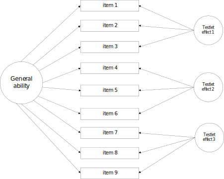
  <figcaption style="font-size: small; text-align: center; margin-top: 10px">Grafik aus @Zhang.2011</figcaption>
  </figure>
</div>

## Motivation

<div>
- Professionswissens von Chemie-Studierenden mit Lehramtsoption
- deklarativ-fachdidaktischer Wissenstest
- Bayes'sches MIRT-Modell ab 100 Personen <small>[@Fujimoto.2020]</small>
</div>

<div style="position: absolute; bottom: 60px; width: 1000px">
  <figure>
  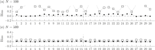
  <figcaption style="font-size: small; text-align: center; margin-top: 10px">Biasreduzierender Effekt informativer Priors; Grafik aus @Fujimoto.2020</figcaption>
  </figure>
</div>

<div class="notes">
- Prior-Einfluss verschwindet ab 500 Beobachtungen
- Wechsel zur Bayes'schen Methodik
</div>

## Motivation

<div>
- Professionswissens von Chemie-Studierenden mit Lehramtsoption
- deklarativ-fachdidaktischer Wissenstest
- Bayes'sches MIRT-Modell ab 100 Personen <small>[@Fujimoto.2020]</small>
- Bayes'sche IRT Modellierung mit brms <small>[@Burkner.23.05.2019]</small>
</div>

<div style="position: absolute; bottom: 60px; width: 1000px">
  <figure class="txtover">
  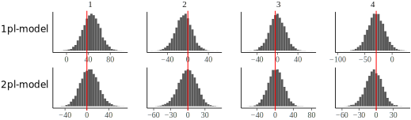
  <figcaption style="font-size: small; text-align: center; margin-top: 5px">Posterior Predictive Model Check (**PPMC**); Grafik aus @Burkner.2020</figcaption>
  </figure>
</div>

<div class="notes">
- deutlich: loglik-Kriterium für Item 1 und 4 (5, 6, 9, 10, 12) nicht reproduziert durch geschätzte Schwierigkeit allein
</div>

## Motivation

  <figure>
  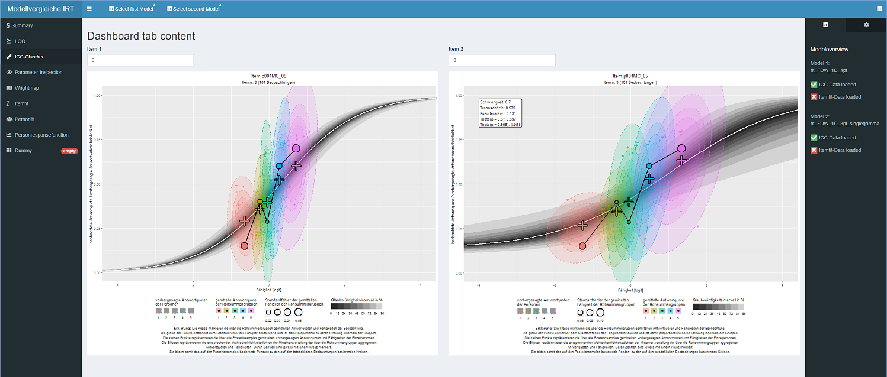
  <figcaption style="font-size: small; text-align: center; margin-top: 5px">Shiny-App für den direkten Modellvergleich</figcaption>
  </figure>


<div class="notes">
- 1pl bis 3pl
- mit und ohne Testlets
- nur für die eigenen Modelle
- Shiny-App für allgemeine Modelle mit **birtms** das Ziel
</div>

## Motivation

<div>
- Professionswissens von Chemie-Studierenden mit Lehramtsoption
- deklarativ-fachdidaktischer Wissenstest
- Bayes'sches MIRT-Modell ab 100 Personen <small>[@Fujimoto.2020]</small>
- Bayes'sche IRT Modellierung mit brms <small>[@Burkner.23.05.2019]</small>
- Marginal Likelihood für Modellvergleiche <small>[@Merkle.2019]</small>
</div>

<div style="position: absolute; bottom: 60px; width: 1000px">
  <figure>
  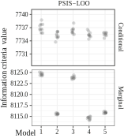
  <figcaption style="font-size: small; text-align: center; margin-top: 5px">Informationskriterien unter Nutzung der conditional und marginal likelihood; Grafik aus @Merkle.2019</figcaption>
  </figure>
</div>

<div class="notes">
- Vergleich von 5 Modellen mit unterschiedlich vielen Freiheitsgraden
- conditional loglik
  - Schätzfehler größer
  - IC Wert generell geringer (gaukelt guten fit vor)
  - komplexere Modelle passen tendenziell besser
- marginal loglik: Entscheidung für Model 2
</div>

## Inferenzstatistik {.build}

<div style="float: right; width: 50%; margin-top: -60px; opacity: 1;">
  <figure>
  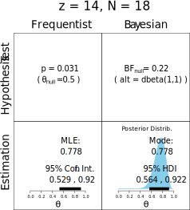
  <figcaption style="font-size: small; text-align: center; margin-top: 5px;">Grafik aus @Kruschke.2018</figcaption>
  </figure>
</div>

<div style="float: left; width: 50%; margin-top: 0px">
### Probleme mit NHST
- abhängig von Datenerhebung/-auswertung
- $H_0$ oft quatsch
- contra Nullhypothese $\nLeftrightarrow$ <br>pro Alternativhypothese
- Effektstärke?
- Informationsverlust
- Interpretation
- Meehls Paradoxon <small>[@Meehl.1997]</small>
</div>

<div class="notes">
- Bayes-Faktor: pro H0, ungewiss, pro H1
- Informationsverlust
  - behindert Metaaanalysen
- Meehls Paradoxon <small>[@Meehl.1997]</small>
  - NHST verwirft H0 mit vielen Daten immer
</div>

## Inferenzstatistik

<div style="float: right; width: 50%; margin-top: -60px">
  <figure>
  
  <figcaption style="font-size: small; text-align: center; margin-top: 5px;">Grafik aus @Kruschke.2018</figcaption>
  </figure>
</div>

<div style="float: left; width: 50%; margin-top: 0px">
### Probleme mit "new statistics"
- abhängig von Datenerhebung/-auswertung
- Parameterverteilung?
- Meehls Paradoxon <small>[@Meehl.1997]</small>
</div>

<div class="notes">
- CI enthält Werte, die von NHST nicht abgelehnt würden
- CI: Konfidenzintervall basiert auf Vorannahmen und Schätzungen
  - Interpretationbasier auf vielen Wiederholungen:<br>der wahre Parameter in 95 % der Fälle im CI liegen
- keine Informationen über Parameterverteilung
  - Unimodalität
  - Schiefe
</div>

## Inferenzstatistik

<div style="width: 50%; float: left;">
### Vorteile frequentistischer Methodik

- Akzeptanz / Bekanntheit
- eigener Wissensstand
- Werkzeuge
  - Verfügbarkeit
  - Effizienz
</div>

## Inferenzstatistik

<div style="width: 50%; float: left;">
### Vorteile Bayes'scher Methodik

- flexible Modellierung
- valide für kleine Stichproben
- Auswertung unabhängig von
  - Abschlusskriterium der Studie
  - Anzahl und Art der Tests
- intuitive Interpretation
- Vorwissen nutzbar
- Parameterverteilung
</div>

<div class="notes">
- nicht auf etablierte Modelle beschränkt
- likelihood unabhängig vom Vorgehen
- seltene Fälle berücksichtigen (z. B.Krankheiten)
</div>

## Inferenzstatistik

<div style="width: 50%; float: left;">
### Vorteile Bayes'scher Methodik

- flexible Modellierung
- valide für kleine Stichproben
- Auswertung unabhängig von
  - Abschlusskriterium der Studie
  - Anzahl und Art der Tests
- intuitive Interpretation
- Vorwissen nutzbar
- Parameterverteilung
</div>

<div style="width: 50%; float: right;">
### Probleme Bayes'scher Methodik

- Software-Verfügbarkeit
- Hardwareanforderungen

Variable | TAM | brms
----------|--------|----------------
Zeit in s | 0.06  |  138
Iterationen | 36 | 4000 + **4000 + X**
Speicher in MB |  0.46 | 34.73
Werte je Parameter | 3 | 4000
</div>

## Inferenzstatistik

<div style="width: 50%; float: left;">
### Vorteile Bayes'scher Methodik

- flexible Modellierung
- valide für kleine Stichproben
- Auswertung unabhängig von
  - Abschlusskriterium der Studie
  - Anzahl und Art der Tests
- intuitive Interpretation
- Vorwissen nutzbar
- Parameterverteilung
</div>

<div style="width: 50%; float: right;">
### Probleme Bayes'scher Methodik

- Software-Verfügbarkeit
- Hardwareanforderungen
- Kommunikationsaufwand

<figure>
    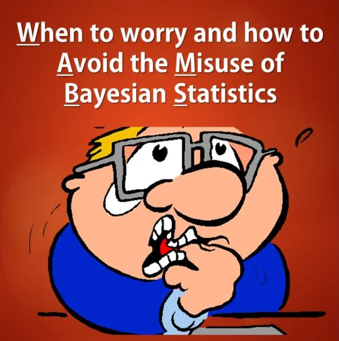
    <figcaption style="font-size: small; text-align: center;">[WAMBS-Checklist](https://www.rensvandeschoot.com/wambs-checklist/)</figcaption>
  </figure>
</div>

## Parameterverteilungen {.build}

<diV style="float: left; width: 100%; margin-top: -20px; opacity: 1;">
```{r echo=TRUE, class.output = "small"}
i1_easyness <- brms::ranef(fit_1d_1pl_spm, summary = FALSE)$item[,"i1",1]
head(i1_easyness, n = 48) %>% round(2)
```
</div>

<diV style="float: left; width: 50%;">
- MCMC-Verfahren
- Wahrscheinlichkeit(sdichte)
- Breite $\sim$ Unsicherheit
- Unsicherheit in Folgeanalysen nutzbar
- **HDI als Basis für Inferenz**
</div>

<diV style="float: right; width: 50%;">
```{r echo=TRUE, out.width="80%"}
i1_easyness %>% birtms::plot_ppmc_distribution()
```
</div>

<div style="background-color: rgba(255,50,50,0.25); position: absolute; top: 409px; left: 695px; width: 25px; height: 208px;"></div>

<div class="notes">
  - Markow-Chain-Monte-Carlo
  - zusätzliches ROPE, um Meehls Paradoxon zu überwinden
</div>

## Parameterverteilungen {.build}

<div style="width: 50%; float: left; opacity: 1; margin-top: 100px;">
  <figure>
  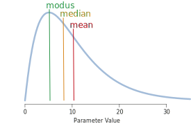
  <figcaption style="font-size: small; text-align: center;">Grafik aus @Kruschke.2015</figcaption>
  </figure>
</div>

<div style="float: right; width: 50%;">
<diV style="margin-top: -40px">
```{r eval=TRUE, results='hide', fig.keep='last', out.width="100%"}
alpha_conf <- .05
alpha_1 <- 11
beta_1 <- 30
alpha_2 <- 25
beta_2 <- 8

mixture_density <- function(x, alpha_1, alpha_2, beta_1, beta_2) {
  .5 * dbeta(x, alpha_1, beta_1) + .5 * dbeta(x, alpha_2, beta_2)
}

# generate data to compute empirical quantiles
n_sim <- 1000000
theta_1 <- rbeta(n_sim / 2, alpha_1, beta_1)
theta_2 <- rbeta(n_sim / 2, alpha_2, beta_2)
theta <- sort(c(theta_1, theta_2))

lower_idx <- round((alpha_conf / 2) * n_sim)
upper_idx <- round((1 - alpha_conf / 2) * n_sim)
q_lower <- theta[lower_idx]
q_upper <- theta[upper_idx]

x <- seq(0,1, by = 0.001)
y_val <- mixture_density(x, alpha_1, alpha_2, beta_1, beta_2)
x_coord <- c(q_lower, x[x >= q_lower & x <= q_upper], q_upper)
y_coord <- c(0, y_val[x >= q_lower & x <= q_upper], 0)

plot(x, mixture_density(x, alpha_1, alpha_2, beta_1, beta_2),
     type='l', col = 'black', lwd = 1,
     xlab = expression(theta), ylab = 'density')
polygon(x_coord, y_coord, col = 'skyblue', lwd = 1,  border = 'black')
```
</div>

<diV style="margin-top: -100px">
```{r eval=TRUE, results='hide', fig.keep='last', out.width="100%"}
dens <- density(theta)
HPD_region <- HDInterval::hdi(dens, allowSplit = TRUE)
height <- attr(HPD_region, 'height')
lower <- HPD_region[1,1]
upper <- HPD_region[1,2]

x_coord <- c(lower, x[x >= lower & x <= upper], upper)
y_coord <- c(0, y_val[x >= lower & x <= upper], 0)

plot(x, mixture_density(x, alpha_1, alpha_2, beta_1, beta_2),
     type='l', col = 'black', lwd = 1,
     xlab = expression(theta), ylab = 'density')
polygon(x_coord, y_coord, col = 'skyblue', lwd = 1,  border = 'black')

lower <- HPD_region[2,1]
upper <- HPD_region[2,2]
x_coord <- c(lower, x[x >= lower & x <= upper], upper)
y_coord <- c(0, y_val[x >= lower & x <= upper], 0)
polygon(x_coord, y_coord, col = 'skyblue', lwd = 1, border = 'black')

abline(h = height, col = 'black', lty = 2, lwd = 2)
```

<div style="margin-top: -50px; width: 100%; text-align: center;"><small>Grafiken mittels Code von @Hyvonen.2019</small></div>
</div>
</div>

<div class="notes">
  - Bimodale und schiefe Verteilungen identifizierbar
  - Maße zentraler Tendenz und CI wählbar
</div>

## Item Response Theorie

<div style="width: 50%; float: left">
- latente Variablen
  - Personenfähigkeiten $\theta_k$
  - Itemparameter $\beta_i, \alpha_i, \dots$
- logistisches Modell (GLM)
- lokale Unabhängigkeit
</div>

## Item Response Theorie

<div style="width: 50%; float: left">
- latente Variablen
  - Personenfähigkeiten $\theta_k$
  - Itemparameter $\beta_i, \alpha_i, \dots$
- logistisches Modell (GLM)
- lokale Unabhängigkeit

<div class="nospace" style="padding-top: 20px">**Raschmodell:**</div>
$$P\left(1|\theta_k, \beta_i\right)=\frac{\exp\left(\theta_k + \beta_i\right)}{1+\exp\left(\theta_k + \beta_i\right)}$$
</div>

## Item Response Theorie

<div style="width: 50%; float: left">
- latente Variablen
  - Personenfähigkeiten $\theta_k$
  - Itemparameter $\beta_i, \alpha_i, \dots$
- logistisches Modell (GLM)
- lokale Unabhängigkeit

<div class="nospace" style="padding-top: 20px">**Raschmodell:**</div>
$$P\left(1|\theta_k, \beta_i\right)=\frac{\exp\left(\theta_k + \beta_i\right)}{1+\exp\left(\theta_k + \beta_i\right)}$$
</div>

<div style="width: 50%; float: right; margin-top: 10px">
  <figure>
    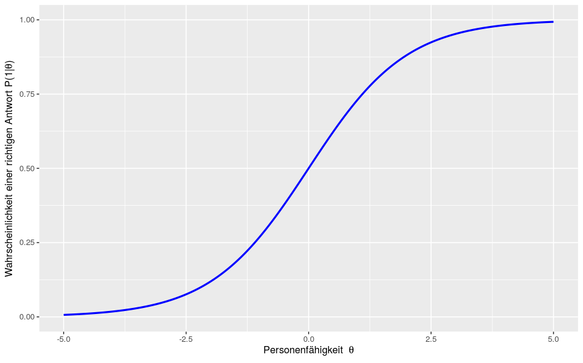
    <figcaption style="font-size: small; text-align: center;">Grafik aus @Grottke.2021</figcaption>
  </figure>
</div>

## Item Response Theorie

<div style="width: 50%; float: left">
- latente Variablen
  - Personenfähigkeiten $\theta_k$
  - Itemparameter $\beta_i, \alpha_i, \dots$
- logistisches Modell (GLM)
- lokale Unabhängigkeit

<div class="nospace" style="padding-top: 20px">**Raschmodell:**</div>
$$P\left(1|\theta_k, \beta_i\right)=\frac{\exp\left(\theta_k + \beta_i\right)}{1+\exp\left(\theta_k + \beta_i\right)}$$
</div>

<div style="width: 50%; float: right; margin-top: 10px">
  <figure>
    
    <figcaption style="font-size: small; text-align: center;">Grafik aus @Grottke.2021</figcaption>
  </figure>
</div>

<div style="width: 50%; float: right; padding-top: 20px">
<div class="lessspace">*Ausnahmen:*</div>
- latente Regression
- Testlets

## Bayes'sche IRT-Modellierung in R {.build}

<div style="width: 50%; float: left; opacity: 1;">
1. Daten vorbereiten
1. Modell formulieren
1. Vorannahmen formulieren
1. Modell fitten
</div>

<div style="width: 50%; float: right;">
```{r echo=TRUE}
data_spm_long <- data_spm %>%
  birtms::compose_dataset(
    response_columns = i1:i12)
```
</div>

<div style="width: 50%; float: right;">
```{r echo=TRUE, eval=TRUE}
(formula1PL <- birtms::build_formula())
```
</div>

<div style="width: 100%; float: right;">
```{r echo=TRUE}
prior_1PL <- brms::prior("normal(0, 3)", class = "sd", group = "person") +
  brms::prior("normal(0, 3)", class = "sd", group = "item")
```
</div>

<div style="width: 100%; float: right;">
```{r echo=TRUE, eval=FALSE}
fit_1d_1pl_spm <- birtms::birtm(
  data = data_spm_long, formula = formula1PL, 
  prior = prior_1PL, file = "models/fit_1d_1pl_spm"
  )
```
</div>

## Konvergenz prüfen {.build}

<diV style="width: 100%; opacity: 1;">
```{r echo=TRUE, class.output = "small"}
summary(fit_1d_1pl_spm, robust = TRUE)
```
</div>

<div style="background-color: rgba(50,50,255,0.25); position: absolute; top: 407px; left: 590px; width: 50px; height: 20px;"></div>

<div style="background-color: rgba(50,255,50,0.25); position: absolute; top: 407px; left: 675px; width: 150px; height: 20px;"></div>


<div class="notes">
- Konvergenz: $\hat{r}$
- ESS
- Schiefe
- Multimodalität
</div>

## Konvergenz prüfen

<diV style="float: left; width: 50%;">
```{r echo=TRUE, out.width="100%"}
bayesplot::mcmc_trace(
  fit_1d_1pl_spm, pars = c("b_Intercept")
  )
```
</div>

<diV style="float: right; width: 50%;">
  <figure>
  
  <figcaption style="font-size: small; text-align: center; margin-top: 5px;">Grafik von @Clark.2018</figcaption>
  </figure>
</div>

## birtms-Featurelist

<div style="float: left; width: 100%;">
<div class="lessspace">**Itemchecks:**</div>
- Itemparameterverteilungen
- Item Characteristic Curves
- Posterior Predictive Model Checks
</div>

<div class="notes">
- bisher alles mit **brms** möglich
- IRT-spezifische Auswertung mit **birtms**
</div>

## Itemchecks

<diV style="float: left; width: 100%;">
<center>
```{r echo = FALSE}
cowplot::plot_grid(birtms::plot_itemparameter(fit_1d_2pl_spm, pars = "slope", style = "halfeye", items = c(6,9), alphacut = c(.4, .6, 2), thresholds = c(0,4)),
birtms::plot_itemparameter(fit_1d_2pl_spm, pars = "difficulty", style = "halfeye", items = c(6,9), thresholds = c(-2,2)), nrow = 2)
```
</center></div>

## Itemchecks
<diV style="float: left; width: 100%; margin-top: -35px;">
```{r echo=TRUE, message = FALSE, eval=FALSE}
g_spm_2pl <- birtms::ICC_check(
  fit_1d_2pl_spm, post_responses = posterior_responses_spm_2pl,
  num_groups = 6, item_id = 12, ellipse_type = "axisparallel")
```

  <figure>
  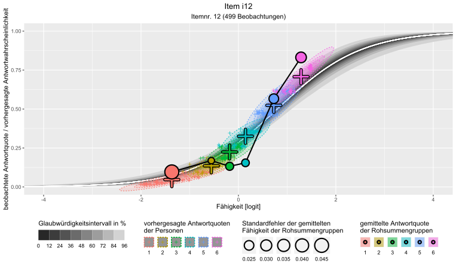
  </figure>
</div>

<div class="notes">
- Achsen-parallele Ellipsen sind besser sichtbar
- sonst lieber "t" oder "norm" nutzen
</div>

## birtms-Featurelist

<div style="float: left; width: 50%;">
<div class="lessspace">**Itemchecks:**</div>
- Itemparameterverteilungen
- Item Characteristic Curves
- Itemfit

<div class="lessspace">**Modellvergleiche:**</div>
- **marginal loo-cv**
- Itemweise:
  - PPMC
  - Odds-Ratios
  - *ICCs*
</div>

## Modellvergleiche

### leave-one-out crossvalidation

<div style="float: left; width: 100%">
```{r include=FALSE}
if (file.exists("../../models/gdcp/marg_loo1pl.rds")) {
  marg_loo1pl <- readRDS("../../models/gdcp/marg_loo1pl.rds")
} else {
  marg_loo1pl <- birtms::loo_marginal(fit_1d_1pl_spm)
  marg_loo1pl %>% saveRDS("../../models/gdcp/marg_loo1pl.rds")
}

if (file.exists("../../models/gdcp/marg_loo2pl.rds")) {
  marg_loo2pl <- readRDS("../../models/gdcp/marg_loo2pl.rds")
} else {
  marg_loo2pl <- birtms::loo_marginal(fit_1d_2pl_spm)
  marg_loo2pl %>% saveRDS("../../models/gdcp/marg_loo2pl.rds")
}
```

```{r echo=TRUE, eval=FALSE}
marg_loo1pl <- birtms::loo_marginal(fit_1d_1pl_spm)
marg_loo2pl <- birtms::loo_marginal(fit_1d_2pl_spm)
```

```{r echo=TRUE}
loo::loo_compare(marg_loo1pl, marg_loo2pl)
```

</div>

<div class="notes">
[elpd_se Interpretation](https://avehtari.github.io/modelselection/CV-FAQ.html#15_How_to_interpret_in_Standard_error_(SE)_of_elpd_difference_(elpd_diff))
- elpd_diff > 4 und > 2*se => Modell passt besser
</div>

## Modellvergleiche

<div style="width: 100%; margin-top: -40px;">
### Posterior Predictive Model Checks

<center>
  <figure>
  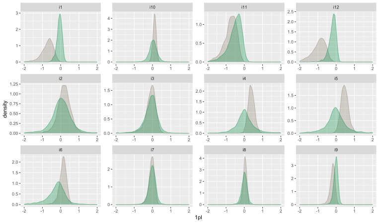
  <figcaption style="font-size: small; text-align: center; margin-top: 5px;"></figcaption>
  </figure>
</center></div>

<div class="notes">
- 2pl-Modell passt für viele Items besser
- Outfit wesentich besser
</div>

## Modellvergleiche

```{r include=FALSE}
if (file.exists("../../models/gdcp/ordata_1pl_spm_fullbayes.rds")) {
  ordata_1pl_spm_fullbayes <- readRDS("../../models/gdcp/ordata_1pl_spm_fullbayes.rds")
} else {
  ordata_1pl_spm_fullbayes <- fit_1d_1pl_spm %>% birtms::get_or(zero_correction = 'Bayes',
                                                      ci_method = 'BayesHDI')
  ordata_1pl_spm_fullbayes %>% saveRDS("../../models/gdcp/ordata_1pl_spm_fullbayes.rds")
}

if (file.exists("../../models/gdcp/ordata_2pl_spm_fullbayes.rds")) {
  ordata_2pl_spm_fullbayes <- readRDS("../../models/gdcp/ordata_2pl_spm_fullbayes.rds")
} else {
  ordata_2pl_spm_fullbayes <- fit_1d_2pl_spm %>% birtms::get_or(zero_correction = 'Bayes',
                                                      ci_method = 'BayesHDI')
  ordata_2pl_spm_fullbayes %>% saveRDS("../../models/gdcp/ordata_2pl_spm_fullbayes.rds")
}
```

<div style="margin-top: -50px">
### Odds-ratio PPMC

<div style="float: left; width: 49%;">
```{r echo=TRUE, eval=FALSE}
ordata_1pl_spm_fullbayes %>% 
  birtms::plot_ppmc_or_heatmap()
```
</div>

<div style="float: right; width: 50%;">
```{r echo=TRUE, eval=FALSE}
ordata_2pl_spm_fullbayes %>% 
  birtms::plot_ppmc_or_heatmap()
```
</div>

<div style="float: right; width: 50%; margin-right: 150px">
```{r out.width="130%"}
ordata_2pl_spm_fullbayes %>% birtms::plot_ppmc_or_heatmap(itemrange = c(1,12))
```
</div>

<div style="float: left; width: 50%; margin-left: -150px">
```{r out.width="130%"}
ordata_1pl_spm_fullbayes %>% birtms::plot_ppmc_or_heatmap(itemrange = c(1,12))
```
</div>
</div>

<div class="notes">
- Rechenbedarf $\sim$ Itemanzahl$^2$
- Unterschied zw. Bayes und klassisch klein
- 2pl besser
</div>

## Modellvergleiche

<div style="margin-top: -50px">
### Odds-ratio-Limit-Check

<div style="float: left; width: 50%;">
```{r echo=TRUE, eval=FALSE}
ordata_2pl_spm_fullbayes %>% 
  birtms::plot_or_heatmap(
    model = fit_1d_2pl_spm)
```
</div>

<div style="float: right; width: 50%;">
```{r bayesian_or_map, echo=TRUE, eval=FALSE, cache=FALSE}
ordata_2pl_spm_fullbayes %>% 
  birtms::plot_or_heatmap(
    model = fit_1d_2pl_spm, bayesian = TRUE)
```
</div>

<div style="float: left; width: 50%; margin-left: -100px; margin-top: -20px;">
```{r out.width="130%"}
ordata_2pl_spm_fullbayes %>% birtms::plot_or_heatmap(itemrange = c(1,12),
                                                     model = fit_1d_2pl_spm)
```
</div>
</div>

<div style="float: right; width: 50%; margin-right: 100px; margin-top: -20px;">
  <figure>
  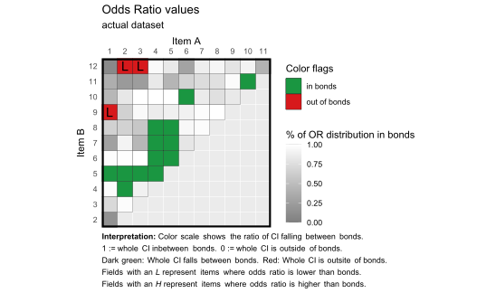
  <figcaption style="font-size: small; text-align: center; margin-top: 5px;"></figcaption>
  </figure>

```{r eval=FALSE, results='hide', fig.keep='all', out.width="130%", message=FALSE}
ordata_2pl_spm_fullbayes %>% birtms::plot_or_heatmap(itemrange = c(1,12),
                                                     model = fit_1d_2pl_spm, bayesian = TRUE)
# hieght for plot: 432 px
```
</div>

<div class="notes">
- 2pl besser
- @Haberman.2007
</div>

## birtms-Featurelist

<div style="float: left; width: 50%;">
<div class="lessspace">**Itemchecks:**</div>
- Itemparameterverteilungen
- Item Characteristic Curves
- *Itemfit*

<div class="lessspace">**Modellvergleiche:**</div>
- **marginal loo-cv**
- Itemweise:
  - PPMC
  - Odds-Ratios
  - *ICCs*
</div>

<div style="float: right; width: 50%;">
<div class="lessspace">**latente Regression:**</div>
- *Parameterverteilungen*
- bayes'sche Variante des $R^2$-Bestimmtheitsmaß

<div class="lessspace">**Personchecks:**</div>
- Person Response Functions
- Personfit

<div class="lessspace">**Sonstiges:**</div>
- Wrightmap
</div>

<div class="notes">
- bisher alles mit **brms** möglich
- IRT-spezifische Auswertung mit **birtms**
</div>

## birtms-Featurelist

<div style="float: left; width: 50%;">
<div class="lessspace">**Itemchecks:**</div>
- Itemparameterverteilungen
- Item Characteristic Curves
- *Itemfit*

<div style="background-color: rgba(50,50,255,0.25); width: 50%;">
<div class="lessspace">**Modellvergleiche:**</div>
- **marginal loo-cv**
- Itemweise:
  - PPMC
  - Odds-Ratios
  - *ICCs*
</div>
</div>

<div style="float: right; width: 50%;">
<div class="lessspace">**latente Regression:**</div>
- *Parameterverteilungen*
- bayes'sche Variante des $R^2$-Bestimmtheitsmaß

<div class="lessspace">**Personchecks:**</div>
- Person Response Functions
- Personfit

<div class="lessspace">**Sonstiges:**</div>
- Wrightmap
</div>

<div class="notes">
<div style="width: 50%; float: left;">
**Theoretisches Konstrukt**
- Dimensionsanalyse
- Modellvergleiche
</div>
</div>

## birtms-Featurelist

<div style="float: left; width: 50%;">
<div class="lessspace">**Itemchecks:**</div>
- Itemparameterverteilungen
- Item Characteristic Curves
- *Itemfit*

<div style="background-color: rgba(50,50,255,0.25); width: 50%;">
<div class="lessspace">**Modellvergleiche:**</div>
- **marginal loo-cv**
- Itemweise:
  - PPMC
  - Odds-Ratios
  - *ICCs*
</div>
</div>

<div style="float: right; width: 50%;">
<div style="background-color: rgba(50,255,50,0.25); width: 80%;">
<div class="lessspace">**latente Regression:**</div>
- *Parameterverteilungen*
- bayes'sche Variante des $R^2$-Bestimmtheitsmaß
</div>

<div class="lessspace">**Personchecks:**</div>
- Person Response Functions
- Personfit

<div class="lessspace">**Sonstiges:**</div>
- Wrightmap
</div>

<div class="notes">
<div style="width: 50%; float: left;">
**Theoretisches Konstrukt**
- Dimensionsanalyse
- Modellvergleiche
</div>

<div style="width: 50%; float: right;">
**Prädiktoren:**
- latente Regression
- ROPE + HDI
- Varianzanalyse
</div>
</div>

## Schluss
<div style="float: left; width: 50%">
### Bitte
- um Nutzung
- um Bugreport
- um Fragen
- um Feedback
</div>

## Schluss
<div style="float: left; width: 50%">
### Bitte
- um Nutzung
- um Bugreport
- um Fragen
- um Feedback
- um Austausch
- um Zusammenarbeit
- um kritischen Prüfung
</div>

## Schluss
<div style="float: left; width: 50%">
### Bitte
- um Nutzung
- um Bugreport
- um Fragen
- um Feedback
- um Austausch
- um Zusammenarbeit
- um kritischen Prüfung
</div>

<div style="float: right; width: 50%">
### Kontakt
<simon.d.schaefer@hu-berlin.de>

[github](https://github.com/Famondir/birtms)
</div>


## Wrightmap

<div style="width: 100%;">
```{r echo=TRUE, eval=FALSE}
fit_1d_1pl_spm %>% birtms::plot_wrightmap(classic = FALSE)
```

<center>
```{r echo=FALSE, message=FALSE, warning=FALSE, out.width="75%"}
fit_1d_1pl_spm %>% birtms::plot_wrightmap(classic = FALSE)
```
</center>
</div>

<div class="notes">
nichts bayesianisches dabei
</div>

## conditional and marginal loo-cv

<div style="float: left; width: 50%;">
  <center>
  <figure>
  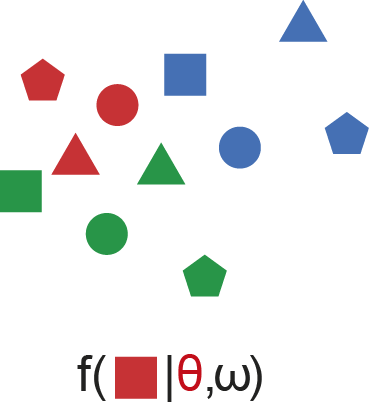
  <figcaption style="font-size: small; text-align: center; margin-top: 5px;">conditional loo</figcaption>
  </figure>
  
  ```{r, out.width="90%"}
  plot(brms::loo(fit_1d_1pl_spm))
  ```
  </center>
</div>

<div style="float: right; width: 50%;">
  <center>
  <figure>
  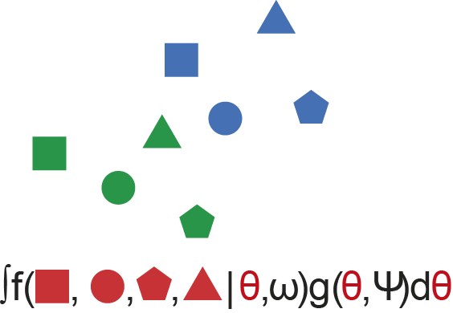
  <figcaption style="font-size: small; text-align: center; margin-top: 5px;">marginal loo</figcaption>
  </figure>
  
  ```{r, out.width="90%"}
  plot(marg_loo1pl)
  ```
  </center>
</div>

## crossvalidation methods {.smaller}

<center>
```{r, out.width="66%"}
ic_1pl_spm <- readRDS("../../models/gdcp/ic_1pl_spm.rds")

crit_vec <- c("10-fold", "grouped 10-fold", "conditional PSIS loo", "marginal PSIS loo")

crit_data <- rbind(
  ic_1pl_spm[[1]]$estimates[1,],
  ic_1pl_spm[[2]]$estimates[1,],
  ic_1pl_spm[[3]]$estimates[1,],
  ic_1pl_spm[[4]]$estimates[1,]
) %>% as_tibble() %>% mutate(information_crit = crit_vec, .before= 1)

crit_data %>% ggplot(aes(x = information_crit, y = Estimate)) +
  geom_point() +
  geom_errorbar(aes(ymin = Estimate-SE, ymax = Estimate+SE))
```
</center>

<div class="lessspace">*Alternativen*</div>
- grouped k-fold crossvalidation
- Bayes Factor via bridgesampling

<div class="notes">
- Bürkner favorisiert PSIS LOO-CV
  - conditional LOO bevorzugt komplexere Modelle
  - marginal LOO weist auf Probleme mit PSIS hin
  - LOO oder k-fold können bei komplexeren Modellen sehr lange dauern
- BayesFaktor via BridgeSampling braucht viele Posterior Samples
  - Bayes-Faktor prior-sensibel
  - Bridge Sampling: 110000 statt 2000
  - preparing_bf = TRUE
  - brms::bayes_factor()
- Kruschke schlägt vor, mehrere Modell in einem Obermodell zusammenzufassen
  - in Stan schwerlich möglich, da keine diskreten Variablen gezogen werden
</div>

## Ausblick {.smaller}

<div style="float: left; width: 50%;">
### Funktionalitäten
- **testlets**
- **Shiny-App**
- *3pl*
- Itemkriterien <small>[vgl. @Scharl.2019]</small>
- hierarchic
- ordinal
- multidim
- multivariate
- 4pl
- noncompensatory
</div>

<div style="float: right; width: 50%;">
### Paket
- Dokumentation
- Vignetten
- Videotutorials
- Performance
- Vereinheitlichung
- Abhängigkeiten reduzieren
- Mehrsprachigkeit
</div>

<div class="notes">
- Dokumentation:
  - Kapitel im GDCP-Psychometriebuch
- multivariat:
  - SEM / latente Variablen
  - Hoffnung: brms 3 Funktionalitäten
</div>

## Sampling {.smaller}

<div style="float: left; width: 50%">
### EM Algorithmus

- Start: Itemschwierigkeit $\sim$ Lösungshäufigkeit
- bis zur Konvergenz:
  - Wähle SD der random effect Verteilung
  - Wähle random effect Werte
  - maximiere die Likelihood
    - analytisch oder per Newton-Verfahren
    - effektiv für weniger Dimensionen
- Präsentiere beste Punktschätzer
- Präsentiere Schätze CI
</div>

<div style="float: right; width: 50%">
### MCMC Algorithmus

- Burn-in / warmup-Pahse
- Sampling-Phase
- Präsentiere Postsamples
- Deskriptive Statistik der Postsamples

<div class="lessspace">Schritte:</div>
- Wähle Parameter in der Imgebung
- berechne Likelihood
  - besser: akzeptiere Werte
  - schlechter: werfe biased Münze
    - Kopf: akzeptiere Werte
    - Zahl: verwerfe Werte, wähle neue
    
[MCMC-Sampling-Applets](https://elevanth.org/blog/2017/11/28/build-a-better-markov-chain/)
</div>

## ROPE

<div style="float: left; width: 100%;">
  <figure>
  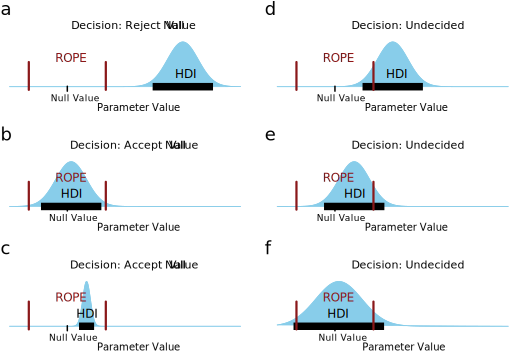
  <figcaption style="font-size: small; text-align: center; margin-top: 5px;">Grafik aus @Waning.2001</figcaption>
  </figure>
</div>

## Literatur

